# Auditoría Visual — Central Admin Panel

**URL:** https://central.alephica.eu/admin
**Fecha:** 2026-04-04
**Viewport desktop:** 1440×900
**Viewport mobile:** 375×812
**Screenshots:** 21 (17 desktop + 4 mobile)

---

## 1. Login (`/admin/login`)

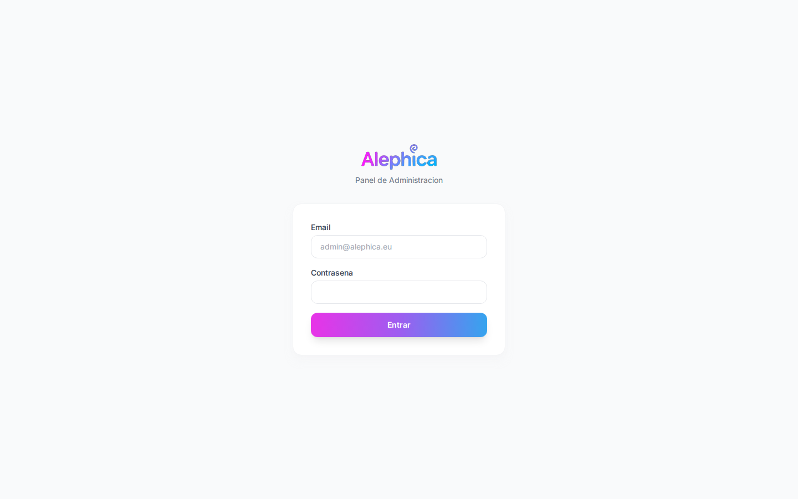

**Qué se ve:** Logo "Alephica" con tildes perdidas en el icono, texto "Panel de Administracion" sin tilde, formulario con 2 inputs (Email, Contrasena) y botón gradiente "Entrar".

**Problemas:**
- ❌ **Tildes faltantes:** `Administracion` → `Administración`, `Contrasena` → `Contraseña`
- ⚠️ Centrado vertical demasiado bajo (el formulario ocupa solo el cuarto superior)
- ⚠️ Sin link de recuperar contraseña ni mensaje de ayuda
- ✓ Gradiente brand bien aplicado al logo y CTA

**Mobile:** ídem desktop — misma tilde faltante. Aceptable responsive.

---

## 2. Dashboard (`/admin`)

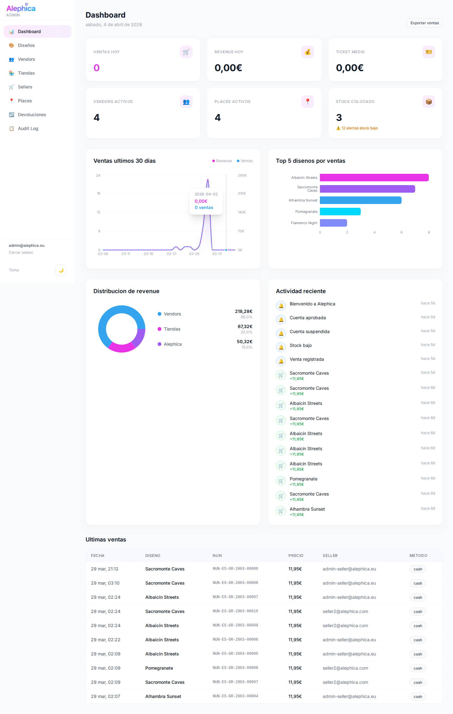

**Qué se ve:** Sidebar con 8 secciones, 6 KPI cards arriba (Ventas hoy, Revenue, Ticket medio, Vendors activos, Places activos, Stock colocado), 2 gráficos (ventas 30 días + top 5 diseños), distribución de revenue (donut), actividad reciente, últimas ventas (10 rows).

**Problemas:**
- ❌ **Tildes faltantes masivas:**
  - `sábado` → correcto, pero `4 de abril de 2026` OK
  - `12 alertas stock bajo` ← OK
  - `Ventas ultimos 30 dias` → `Ventas últimos 30 días`
  - `Top 5 disenos por ventas` → `Top 5 diseños por ventas`
  - `Distribucion de revenue` → `Distribución de revenue`
  - `Actividad reciente` ← OK
  - `Ultimas ventas` → `Últimas ventas`
  - `DISENO` en header de tabla → `DISEÑO`
  - `METODO` → `MÉTODO`
- 🟡 **Emojis en vez de Lucide:** iconos de KPI cards usan emojis (🛒, 💰, 🎫, 👥, 📍, 📦) y en activity feed (⚠️, 🛒)
- 🟡 **Gradiente overused:** sidebar items activos, KPI cards iconos, donut chart — demasiados elementos compitiendo
- ⚠️ **Jerarquía tipográfica débil:** los títulos de sección ("Top 5 disenos", "Distribucion de revenue") son del mismo peso/tamaño que el h1 "Dashboard"
- ⚠️ **Chart labels bajos:** "03-06 / 03-11 / 03-16" está muy cerca del eje, sin respiración
- ⚠️ **Activity feed repetitivo:** 12 items con iconos amarillos/verdes sin diferenciación clara
- ⚠️ **Tabla "Ultimas ventas":** rows bastante apretadas, NUN column muy estrecha, sin color semántico en precios
- ✓ Layout de 3 columnas en KPIs funciona

**Mobile:** stack vertical de todas las cards (OK), pero el activity feed se alarga mucho (12 items). Los datos NUN en la tabla se parten en 4 líneas por row — ilegible.

---

## 3. Diseños Lista (`/admin/designs`)

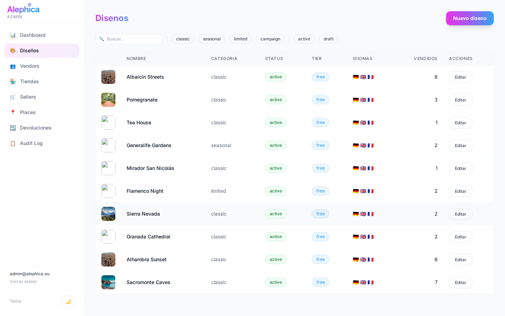

**Qué se ve:** Título "Disenos" (SIN tilde), botón "Nuevo diseno" (SIN tilde), search bar, 6 filtro pills (classic/seasonal/limited/campaign/active/draft), tabla con 10 diseños mostrando thumbnail, nombre, categoría, status, tier, idiomas (emojis flag), vendidos, acciones.

**Problemas:**
- ❌ **Tildes faltantes críticas:** `Disenos` → `Diseños`, `Nuevo diseno` → `Nuevo diseño`
- ❌ **Status/Tier en inglés:** `active`, `draft`, `free` aparecen sin traducir
- 🟡 **Emojis como flags:** Alemania 🇩🇪, UK 🇬🇧, Francia 🇫🇷 — inconsistente con el resto del diseño. Deberían ser códigos (DE/EN/FR) o componentes Badge
- 🟡 **4 diseños sin thumbnail:** Tea House, Generalife Gardens, Mirador San Nicolás, Flamenco Night, Granada Cathedral muestran placeholder vacío. Bug de datos o fallback de imagen
- ⚠️ **Filtros de status visuales:** classic/seasonal/limited/campaign mezclados con active/draft en misma fila — no está claro si son filtros de categoría Y status o de qué
- ⚠️ Acción única "Editar" — no hay acciones rápidas (publish/unpublish/delete)
- ✓ Layout de tabla correcto, thumbnails cuadrados consistentes

**Mobile:** la tabla mantiene todas las columnas aunque el viewport sea pequeño — causa overflow horizontal y texto muy reducido.

---

## 4. Diseño Detalle (`/admin/designs/[id]`)

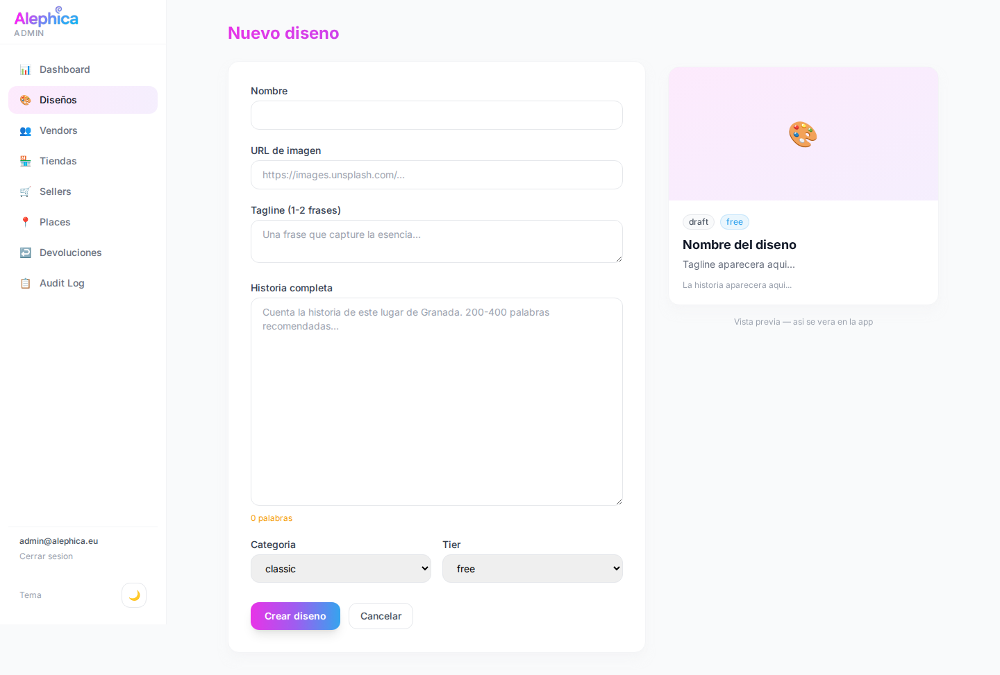

**Qué se ve:** Formulario "Nuevo diseno" (REDIRIGE a /designs/new — parece que el link "Editar" no funciona). Form con Nombre, URL de imagen, Tagline, Historia completa, Categoria, Tier y botones Crear/Cancelar. Preview card con emoji 🎨.

**Problemas:**
- ❌ **BUG:** el link "Editar" del primer diseño abrió `/admin/designs/new` en vez de `/admin/designs/[id]` — parece que el href está mal
- ❌ **Tildes faltantes:** `Nuevo diseno`, `URL de imagen` OK, `Historia completa` OK, `Categoria` → `Categoría`, `Crear diseno`, `Tagline aparecera aqui`, `La historia aparecera aqui`, `Vista previa — asi se vera en la app`, `Nombre del diseno`, `Una frase que capture la esencia`, `Cuenta la historia de este lugar de Granada. 200-400 palabras recomendadas`
- 🟡 **Emoji 🎨** en preview card — debería ser un placeholder con icono Lucide o imagen real
- ⚠️ Los campos `select` tienen styling nativo HTML (gris, no consistente con el resto)
- ⚠️ Contador "0 palabras" en amber sin explicación de qué significa (bajo el rango recomendado?)
- ✓ Split 2/1 form + preview está bien ejecutado

---

## 5. Diseño Nuevo (`/admin/designs/new`)

Idéntico al detalle — mismo formulario de creación. Mismas tildes faltantes, mismo emoji 🎨.

---

## 6. Vendors Lista (`/admin/vendors`)

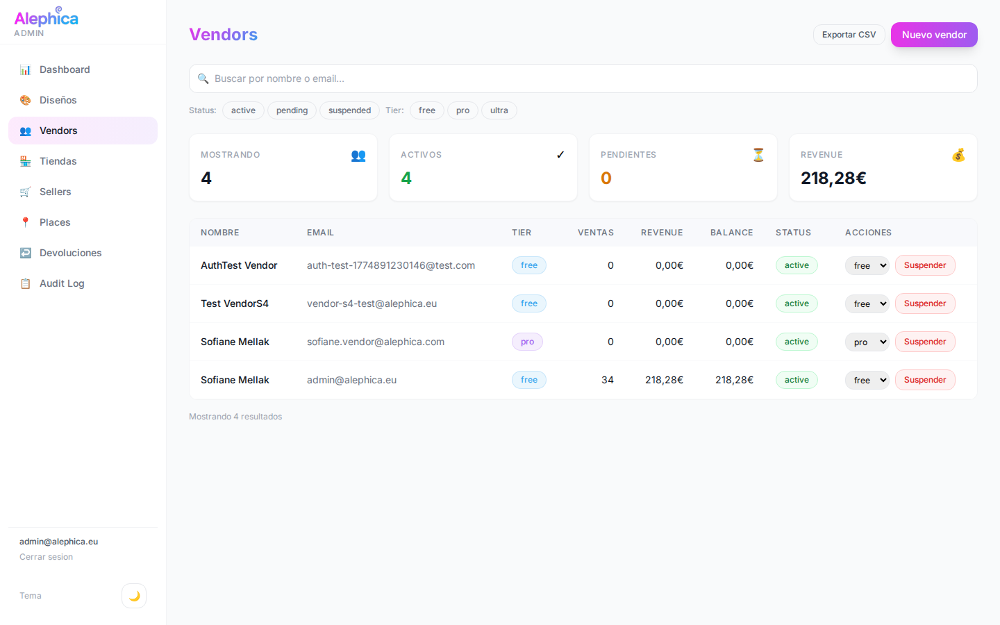

**Qué se ve:** Título "Vendors", botones "Exportar CSV" + "Nuevo vendor". Search bar, filtros por status (active/pending/suspended) + tier (free/pro/ultra), 4 KPI cards (Mostrando, Activos, Pendientes, Revenue), tabla con 4 vendors.

**Problemas:**
- 🟡 **Emojis en iconos KPI:** 👥, ✓, ⏳, 💰
- ❌ **Status/Tier sin traducir:** `active`, `pending`, `suspended`, `free`, `pro`, `ultra`
- ⚠️ **Selects inline** en columna TIER son HTML nativos (feo, gris)
- ⚠️ **Botón "Suspender"** en rojo outline en CADA row — peligroso, invita a error. Debería ser un menu de 3 dots
- ⚠️ **Email column** puede ser muy larga (`auth-test-1774891230146@test.com`) y rompe el layout visual
- ✓ "Sofiane Mellak" repetido dos veces (OK, son cuentas distintas)
- ✓ Bien la tabla de 4 filas — aire respirable

**Mobile:** los filtros tier/status se apilan vertical, 4 KPI cards en grid 1x4 (stack), tabla mantiene columnas.

---

## 7. Vendor Detalle (`/admin/vendors/[id]`)

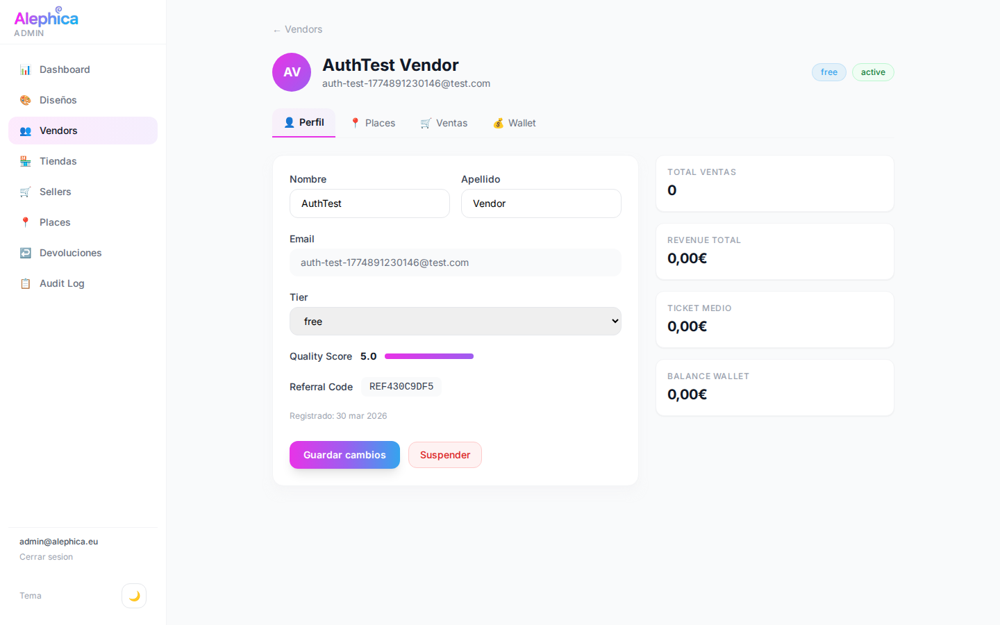

**Qué se ve:** Avatar circular "AV" gradiente, nombre "AuthTest Vendor", email, badges `free` + `active`. 4 tabs: Perfil 👤, Places 📍, Ventas 🛒, Wallet 💰. Form con Nombre/Apellido/Email/Tier, Quality Score bar, Referral Code. 4 KPI cards laterales (Total Ventas, Revenue Total, Ticket Medio, Balance Wallet).

**Problemas:**
- 🟡 **Tabs con emojis:** 👤, 📍, 🛒, 💰 — mismo problema consistencia
- ❌ **Registrado: 30 mar 2026** — buen formato, pero falta tilde en "abril" (no visible aquí)
- ⚠️ **Email input disabled** con fondo gris — OK pero no hay label que indique que es readonly
- ⚠️ **Quality Score 5.0** con barra gradiente que llega al 100% sin contexto (¿sobre 5, sobre 10?)
- ⚠️ **Suspender button** outline rojo next to "Guardar cambios" — botón destructivo demasiado prominente
- ✓ Avatar circular con iniciales funciona bien
- ✓ Split layout form + KPIs lateral funciona

### 7a. Tab Places

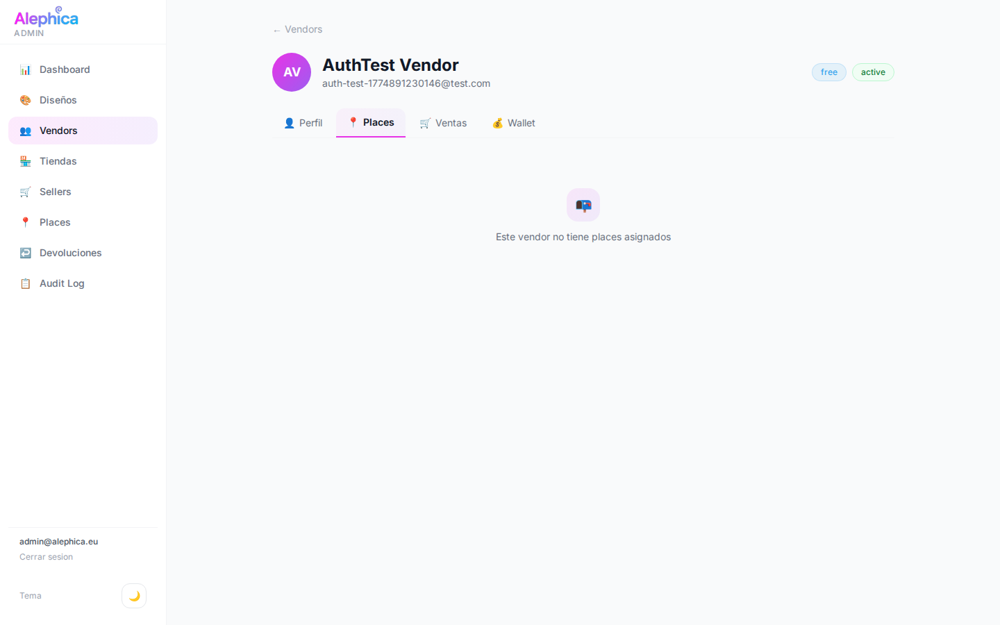

Empty state: icono 📪 (emoji) + texto "Este vendor no tiene places asignados". **Problemas:** icono emoji, sin CTA para añadir place.

### 7b. Tab Ventas

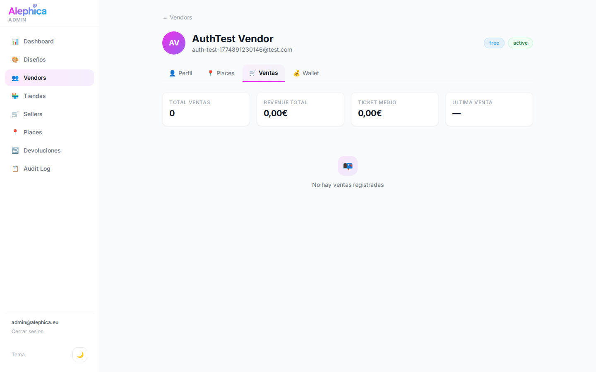

4 KPI cards (Total Ventas, Revenue Total, Ticket Medio, Ultima Venta) + empty state "No hay ventas registradas". **Problemas:** `Ultima Venta` → `Última Venta`, emoji 📪.

### 7c. Tab Wallet

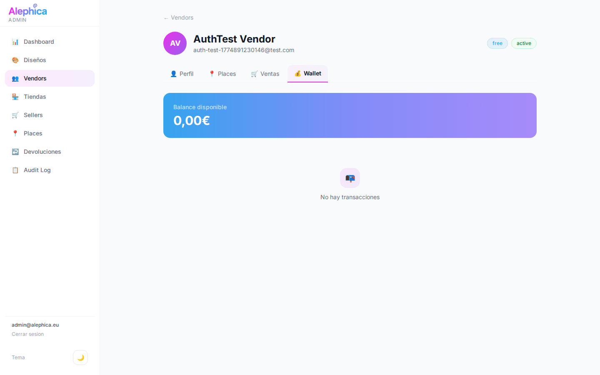

Card gradient "Balance disponible 0,00€" + empty state "No hay transacciones". **Problemas:** emoji 📪. Card gradiente aislada sin contexto.

---

## 8. Tiendas Lista (`/admin/shops`)

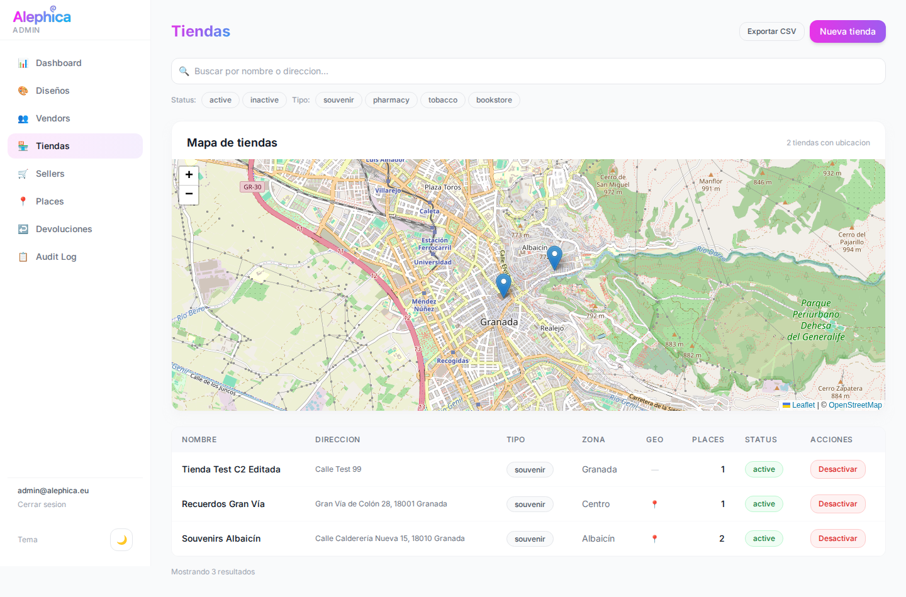

**Qué se ve:** Título "Tiendas" + "Nueva tienda", mapa de tiendas (Leaflet) centrado en Granada con markers, tabla de 3 tiendas (Tienda Test C2 Editada, Recuerdos Gran Vía, Souvenirs Albaicín) con DIRECCION, TIPO, ZONA, SSS (?), PLACES, STATUS, ACCIONES.

**Problemas:**
- ❌ **Tildes faltantes:** `DIRECCION` → `DIRECCIÓN`
- ⚠️ **Columna "SSS"** — no está claro qué significa (probablemente un bug de layout o columna sin header)
- ⚠️ **Mapa ocupa mucho espacio** con solo 3 markers — podría ser colapsable
- ⚠️ Status column muestra dots/badges pero son tiny y poco legibles
- ⚠️ Screenshot parece comprimido/borroso (resolución menor que las otras pages)
- ✓ Link a map provider correcto (OpenStreetMap visible)

---

## 9. Tienda Detalle (`/admin/shops/[id]`)

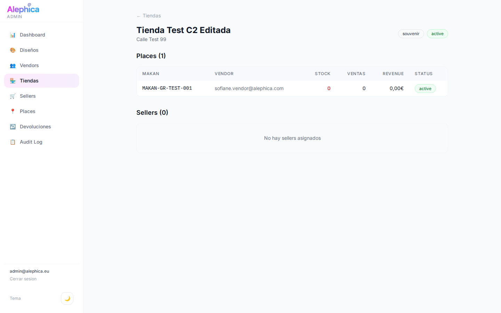

**Qué se ve:** Breadcrumb ← Tiendas, título "Tienda Test C2 Editada" + "Calle Test 99" + badges `souvenir` + `active`. Sección Places (1) con tabla de 1 row, Sección Sellers (0) con empty state "No hay sellers asignados".

**Problemas:**
- 🟡 **Badge `souvenir`** sin color semántico claro (es blanco/outline)
- ⚠️ **Stock column** muestra "0" en rojo — bien semánticamente, pero sin explicación del umbral
- ⚠️ **Sin botón editar** en header — hay que scroll hasta abajo? No visible
- ⚠️ **Empty state minimalista** sin CTA para asignar seller

---

## 10. Sellers Lista (`/admin/sellers`)

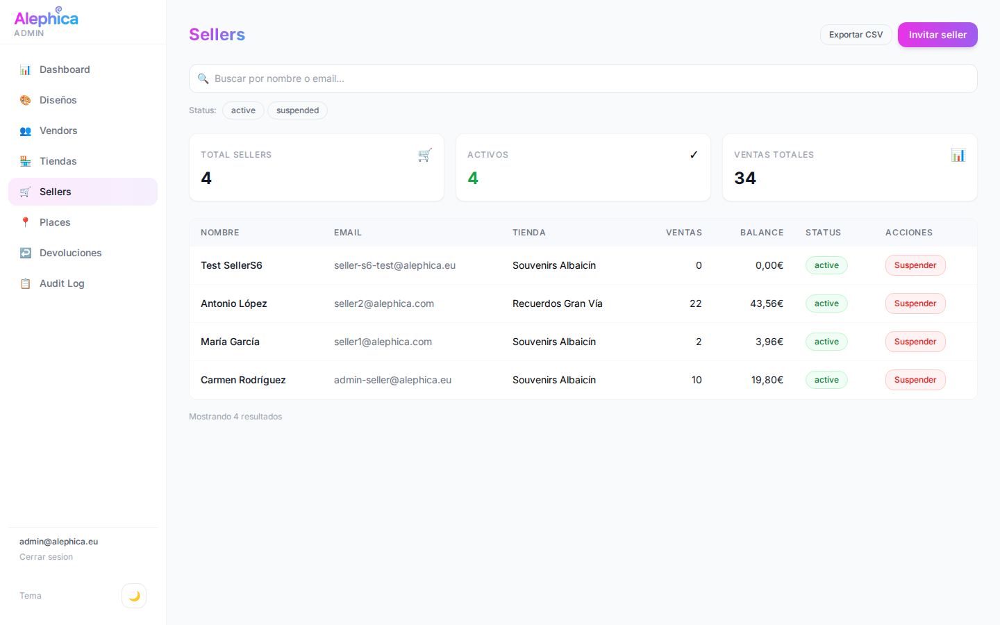

**Qué se ve:** Similar a Vendors. Search bar, filtros active/suspended, 3 KPI cards (Total Sellers, Activos, Ventas Totales), tabla de 4 sellers con NOMBRE, EMAIL, TIENDA, VENTAS, BALANCE, STATUS, ACCIONES.

**Problemas:**
- 🟡 **Emojis KPI icons:** 🛒, ✓, 📊
- ❌ **Status sin traducir:** `active`, `suspended`
- ⚠️ **Botón Suspender rojo** en cada row (mismo problema que Vendors)
- ✓ Datos coherentes: 4 sellers, 34 ventas totales, balance máximo 43,56€
- ✓ Nombre "Souvenirs Albaicín" y "Recuerdos Gran Vía" con tildes correctas

---

## 11. Seller Detalle (`/admin/sellers/[id]`)

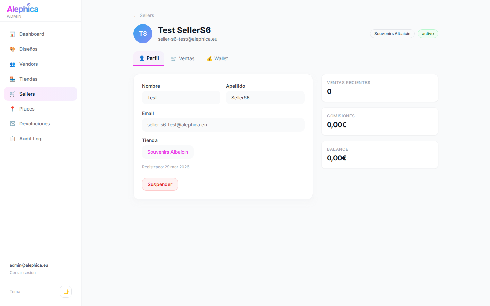

**Qué se ve:** Avatar "TS" azul gradiente, nombre "Test SellerS6", email, badges `Souvenirs Albaicin` (SIN tilde en Albaicín!) + `active`. 3 tabs: Perfil 👤, Ventas 🛒, Wallet 💰. Form con Nombre, Apellido, Email, Tienda (link púrpura), Registrado: 29 mar 2026, botón Suspender.

**Problemas:**
- ❌ **`Souvenirs Albaicin`** (SIN tilde) — inconsistencia grave con la lista que SÍ tiene tilde
- 🟡 **Emojis en tabs:** 👤, 🛒, 💰
- ⚠️ **Tienda como link púrpura** clickable pero sin hover state aparente
- ✓ 3 KPI cards laterales (Ventas Recientes, Comisiones, Balance)
- ✓ Solo botón Suspender — más limpio que Vendor detail

---

## 12. Places Lista (`/admin/places`)

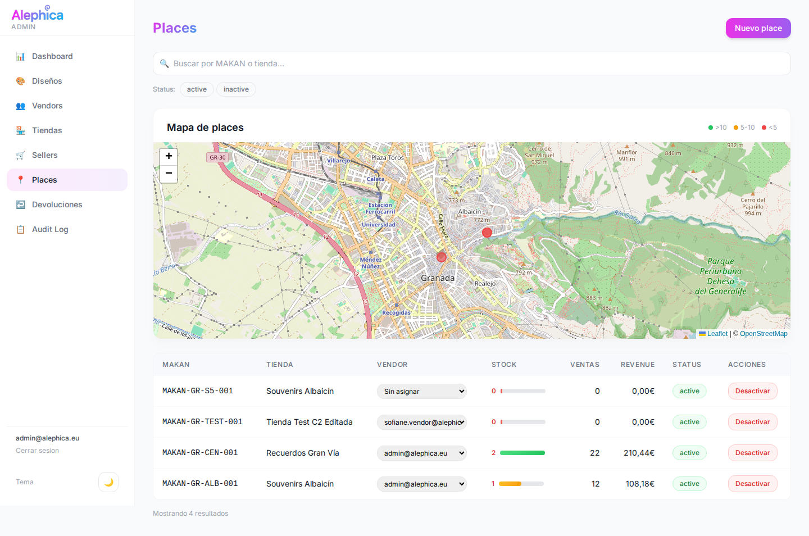

**Qué se ve:** Título "Places", botón "Nuevo place", filtros por MAKAN y diseño, mapa con 3 markers rojos, tabla con 3 places mostrando MAKAN, TIENDA, VENDOR, STOCK, VENTAS, REVENUE, STATUS, ACCIONES.

**Problemas:**
- ⚠️ **Título en inglés:** "Places" → debería ser "Lugares" o al menos documentar por qué no se traduce
- ⚠️ **Título "Mapa de places"** — traducción mixta
- ⚠️ **Screenshot comprimido** (ancho bajo), calidad baja
- ⚠️ Stock column con dots rojos/amber sin explicar código de color
- ✓ Mapa interactivo presente y markers visibles

---

## 13. Devoluciones (`/admin/returns`)

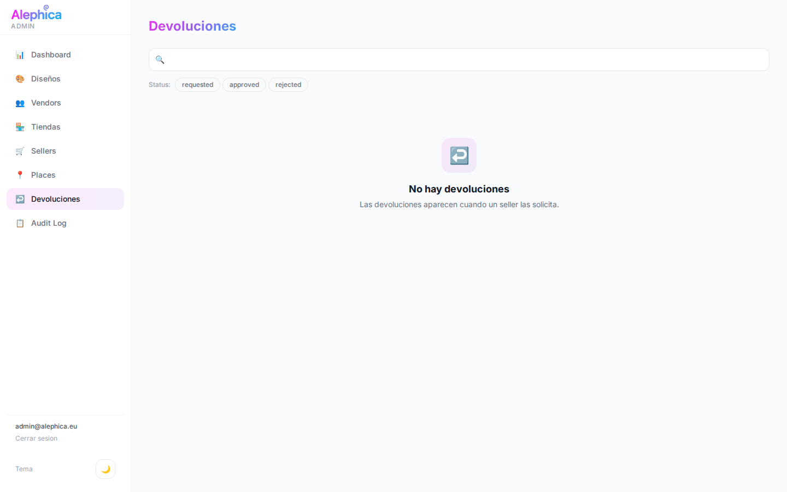

**Qué se ve:** Título "Devoluciones", search bar vacío con icono 🔍, 3 filtros de status (requested/approved/rejected), empty state "No hay devoluciones" + "Las devoluciones aparecen cuando un seller las solicita."

**Problemas:**
- ❌ **Status en inglés:** `requested`, `approved`, `rejected`
- 🟡 **Icono del empty state:** ↩️ azul (icono Lucide-like OK en este caso)
- 🟡 **Emoji 🔍** en search bar
- ✓ Buen empty state con mensaje explicativo
- ✓ Jerarquía clara: filtros → lista

---

## 14. Audit Log (`/admin/audit-log`)

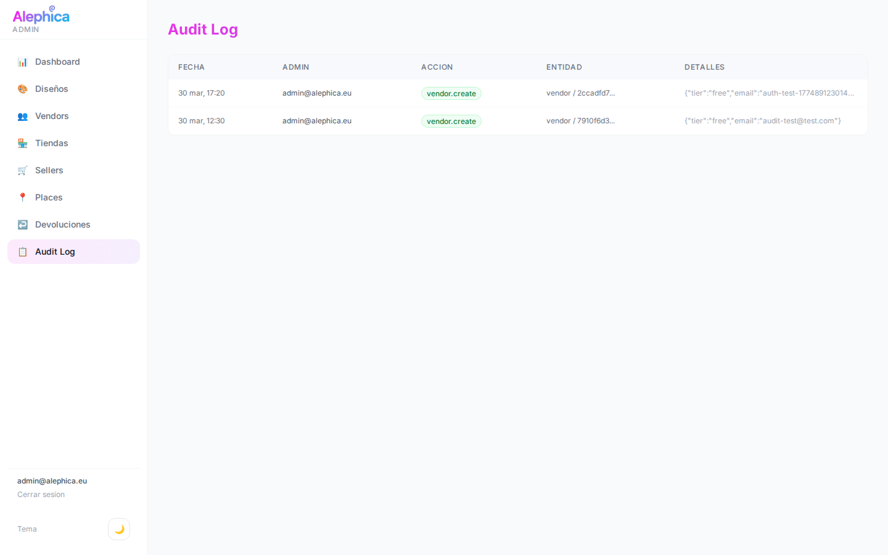

**Qué se ve:** Título "Audit Log" (en inglés), tabla con 2 rows: FECHA, ADMIN, ACCION, ENTIDAD, DETALLES. Action badges verde "vendor.create". Detalles en JSON truncado.

**Problemas:**
- ❌ **Tildes faltantes:** `ACCION` → `ACCIÓN`
- ⚠️ **Título en inglés:** "Audit Log" → "Registro de auditoría"
- ⚠️ **Detalles JSON en raw:** `{"tier":"free","email":"auth-test-177489123014...}` — debería ser tooltip o expandible
- ⚠️ **Solo 2 rows y sin paginación visible** — aceptable si hay pocos datos
- ⚠️ **Sin filtros** por admin, entidad, rango de fechas
- ⚠️ **Entity column con UUID truncado** (`vendor / 2ccadfd7...`) — no es clickable
- ✓ Badge `vendor.create` con color semántico verde apropiado

---

## 15. Captures Mobile

### Mobile Login (375×812)

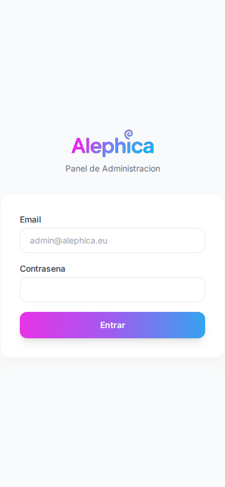

**Problemas:** mismo `Administracion` + `Contrasena`. Form full-width correcto.

### Mobile Dashboard

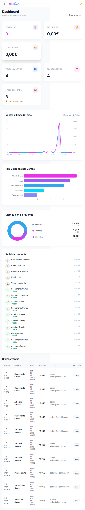

**Problemas:**
- ⚠️ **Sidebar desktop colapsado en header hamburger:** OK, pero el ícono ☰ en la esquina superior izquierda no es obvio
- ⚠️ **KPI cards: 1 por row** — demasiado scrolling, debería ser 2 columnas
- ⚠️ **Tabla "Ultimas ventas" rota:** cada row se parte en 4 líneas (Fecha / Diseño / NUN / Precio), el NUN se fragmenta en 5 líneas por ejemplo `NUN-ES-GR-2603-00009` se ve como 5 líneas. Absolutamente ilegible.
- ⚠️ **Activity feed 12 items:** scroll enorme
- ⚠️ El toggle de tema (luna) visible en top-right

### Mobile Designs

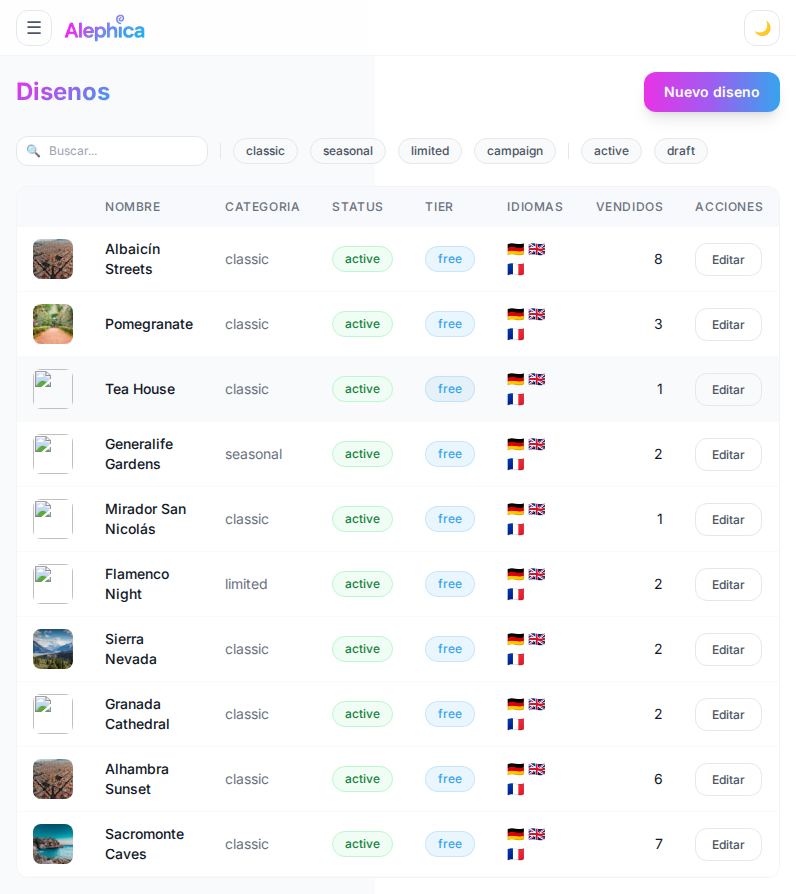

**Problemas:**
- ⚠️ **Tabla horizontal overflow:** mantiene todas las columnas pero el viewport no alcanza → texto truncado en "Albaicín Streets", "Mirador San Nicolás", "Generalife Gardens"
- ⚠️ **Emoji flags** se ven muy pequeños
- ⚠️ **Columna thumbnail** toma espacio innecesario
- ❌ No hay versión responsive — debería ser cards en mobile

### Mobile Vendors

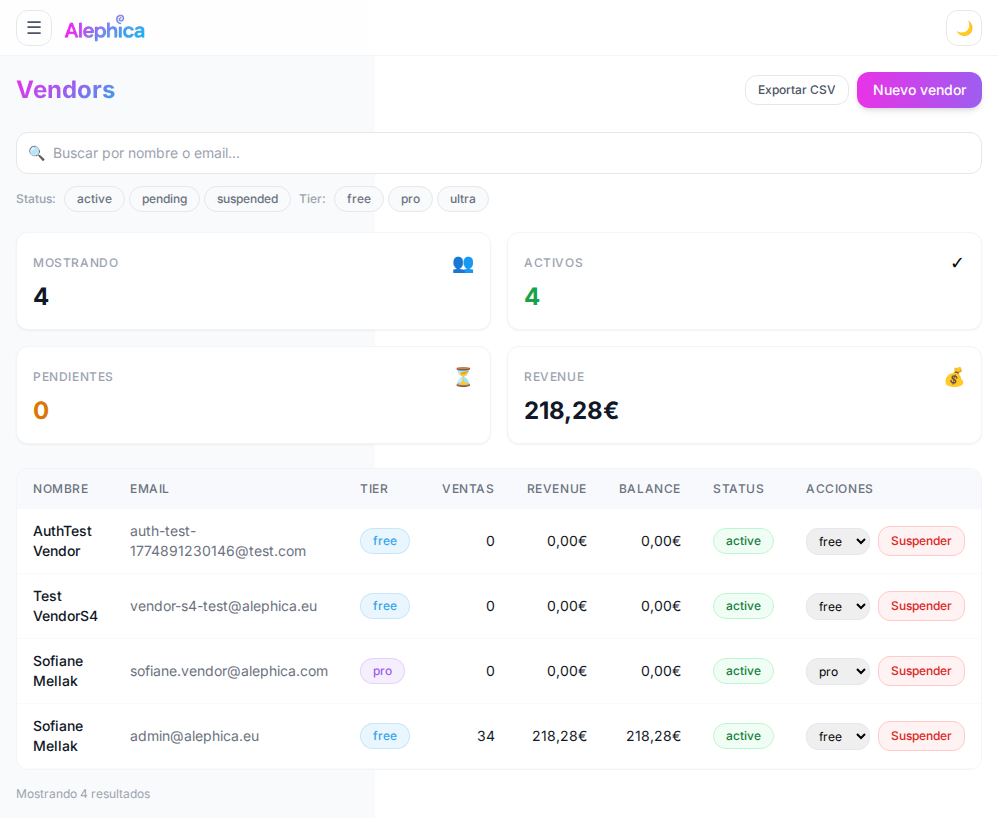

**Problemas:**
- ⚠️ Filtros status/tier en 2 líneas — OK
- ⚠️ KPI cards 2x2 grid (MOSTRANDO/ACTIVOS, PENDIENTES/REVENUE) — mejor que Dashboard
- ⚠️ Tabla mantiene columnas, overflow horizontal

---

## RESUMEN

### Totales por categoría

| Categoría | Cantidad | Severidad |
|---|---|---|
| ❌ Tildes/localización faltantes | **24+** instancias | ALTA |
| ❌ Status/labels sin traducir al español | **10+** instancias | ALTA |
| 🟡 Emojis en vez de Lucide icons | **~40** instancias | MEDIA |
| 🟡 Gradiente sobreutilizado | **5** áreas | MEDIA |
| ⚠️ Jerarquía tipográfica débil | **3** páginas | MEDIA |
| ⚠️ Tablas no responsive en mobile | **5** páginas | ALTA |
| ⚠️ Botones destructivos demasiado prominentes | **2** páginas | MEDIA |
| ⚠️ Screenshots comprimidos (bug SSR?) | **2** páginas | BAJA |
| 🐛 Link "Editar" diseño roto (404/redirect) | **1** bug | ALTA |
| 🐛 Bug `Souvenirs Albaicin` sin tilde en detail | **1** | MEDIA |

### Top 5 páginas que más trabajo necesitan

| # | Página | Razones | Esfuerzo |
|---|---|---|---|
| 1 | **Dashboard** (`/admin`) | Tildes masivas, 6 emojis KPI, tabla "Ultimas ventas" ilegible en mobile, activity feed repetitivo, jerarquía débil | **L** (4-6h) |
| 2 | **Diseños Lista** (`/admin/designs`) | Tildes críticas en título, bug link "Editar", emoji flags, 5 diseños sin thumbnail, responsive roto | **L** (4-6h) |
| 3 | **Vendor Detail** (`/admin/vendors/[id]`) | 4 tabs con emojis, `Ultima Venta` sin tilde, Suspender demasiado prominente, Quality Score sin contexto | **M** (2-3h) |
| 4 | **Login** (`/admin/login`) | `Administracion`, `Contrasena`, centrado vertical off, sin recover link | **S** (1h) |
| 5 | **Audit Log** (`/admin/audit-log`) | `ACCION` sin tilde, título en inglés, JSON raw, sin filtros ni paginación visible | **M** (2-3h) |

### Estimación total de esfuerzo

- **Quick wins** (tildes globales + unicode escapes): **2h** — un find/replace por todo el código fuente
- **Emojis → Lucide**: **3-4h** — reemplazar sistemáticamente en todos los componentes
- **Responsive tables**: **4-5h** — crear variante card para mobile en 5 páginas
- **Bug fixes** (link editar, tilde detail): **1h**
- **Traducciones status/labels**: **2h** — mapeo centralizado de enums
- **Polish** (jerarquía, spacing, destructive buttons): **3-4h**

**TOTAL: ~18-22h de trabajo** para llevar el admin panel a un estado profesional consistente.

---

## Priorización recomendada

**Sprint 1 (quick wins, 1 día):**
1. Fix todas las tildes y unicode (script global)
2. Fix bug link "Editar" diseño
3. Fix tilde `Souvenirs Albaicín` en detail
4. Traducir status badges (active/pending/suspended/free/pro/ultra)

**Sprint 2 (consistency, 1-2 días):**
5. Reemplazar todos los emojis por Lucide icons
6. Responsive tables → cards en mobile
7. Unificar botones destructivos con menu de acciones

**Sprint 3 (polish, 1 día):**
8. Jerarquía tipográfica (h1/h2/h3 claros)
9. Activity feed con grouping
10. Filtros + paginación en Audit Log
