# Auditoría Visual — Seller App

**URL:** https://seller.alephica.eu
**Fecha:** 2026-04-04
**Viewport primario:** 375×812 (mobile — app nativa)
**Viewport secundario:** 1440×900 (desktop — adaptativo)
**Screenshots:** 14 (10 mobile + 4 desktop)

Seller es una **app 100% mobile**: el dependiente escanea productos en tienda física. Auditar como app nativa (Uber/Glovo), no como dashboard.

---

## 1. Login (`/auth/login`)

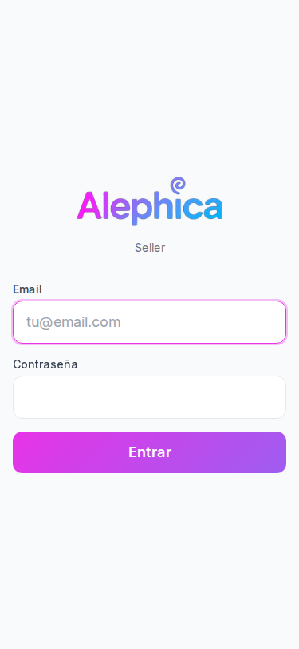

**Qué se ve:** Logo "Alephica" + subtítulo "Seller" centrado. Card con 2 inputs (Email con placeholder `tu@email.com`, Contraseña vacío) y CTA gradiente "Entrar" full-width.

**Problemas:**
- ✓ Tildes correctas (`Contraseña`)
- ✓ Email con focus ring morado al arrancar
- ⚠️ Centrado vertical bajo (formulario en tercio inferior, mucho aire arriba — opuesto al problema de Vendor)
- ⚠️ Sin "¿Olvidaste tu contraseña?" ni "Registrarse" (dependientes se crean desde Central o Vendor, OK — pero conviene un mensaje "Contacta con tu Vendor" si falla login)
- ⚠️ Sin indicador de carga/loading en el botón Entrar
- ⚠️ CTA "Entrar" full-width ~48px altura — ✓ touch target OK
- ⚠️ Subtítulo "Seller" en inglés — ¿"Vendedor"? (decisión de naming)
- ✓ Inputs full-width con mucha altura (~56px) — touch-friendly

---

## 2. Home / Inicio (`/`)

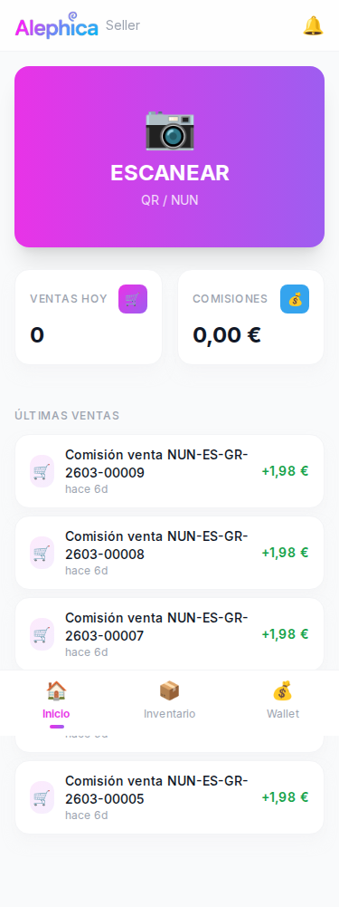

**Qué se ve:** Header slim con Alephica + "Seller" + campana 🔔. Hero gradiente morado/rosa MASIVO con emoji 📷, texto "ESCANEAR" y subtítulo "QR / NUN". 2 KPI cards side-by-side (VENTAS HOY=0, COMISIONES=0,00€). Lista "ÚLTIMAS VENTAS" con rows tipo `Comisión venta NUN-ES-GR-2603-00009 · hace 6d · +1,98€`. Bottom nav 3 tabs (Inicio 🏠, Inventario 📦, Wallet 💰).

**Problemas:**
- ❌ **"Comisión venta NUN-ES-GR-2603-00009" es lenguaje de BD**: el dependiente NO sabe qué producto vendió. Debería mostrar `🎨 Albaicín Streets · mug · hace 6d · +1,98€` — **nombre del diseño** como identificador principal
- ❌ **Bottom nav OVERLAPEA contenido:** la 4ª/5ª row de Últimas Ventas queda tapada — mismo bug que Vendor. Falta `padding-bottom: 80px`
- 🟡 **Emoji 📷 en hero, emojis KPIs (✒️ para ventas, 💰 para comisiones)** — deben ser Lucide `Camera`, `TrendingUp`, `Wallet`
- 🟡 **Bottom nav con emojis** (🏠 Inicio, 📦 Inventario, 💰 Wallet) — Lucide icons (`Home`, `Package`, `Wallet`)
- ⚠️ **Sin nombre del dependiente ni tienda** en el header — ¿en qué tienda estoy operando? ¿Qué usuario?
- ⚠️ **Header sin título de pantalla** ("Inicio") — Alephica logo ocupa el header solo
- ⚠️ **Hero card gradiente domina todo el viewport:** ocupa ~310px de 812px = **38% del viewport** — ✓ bien dimensionado tipo Uber "¿A dónde vas?"
- ⚠️ KPI cards muy simples: sin color semántico, sin delta vs ayer, sin mini-sparkline
- ⚠️ "ÚLTIMAS VENTAS" label en uppercase gris como "página" más que "sección" — podría ser `h2` mayor
- ⚠️ Campana sin badge de notificaciones (aunque haya notifs) — debería indicar conteo
- ✓ Hero ESCANEAR prominente y clickable, cumple el patrón Uber

**Comparación Uber/Glovo:**
- Uber pone "¿A dónde vas?" ocupando ~50% del hero → Seller usa ~38%, aceptable
- Glovo pone grid de categorías 3×2 debajo → Seller usa 2 KPIs + lista, menos accionable
- Airbnb pone búsqueda sticky → aquí el Hero no es sticky (al hacer scroll desaparece)

---

## 3. Scan (`/scan`)

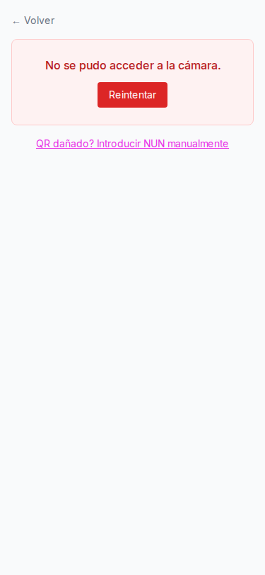

**Qué se ve:** Breadcrumb "← Volver". Card rojo con "No se pudo acceder a la cámara" + CTA "Reintentar" rojo. Link magenta "QR dañado? Introducir NUN manualmente". Resto de la pantalla vacío.

**Problemas:**
- ❌ **No hay estado "cámara activa" diseñado** en la captura (o no se ha podido probar). Se muestra directamente el error — sin viewfinder, sin cuadro de escaneo, sin instrucciones, sin overlay de guía
- ❌ **Error muy prominente en card rojo, pero sin explicación útil:** ¿el usuario debe conceder permisos? ¿es un bug? Sin guía "Activar cámara en Ajustes del navegador"
- 🟡 **"QR dañado? Introducir NUN manualmente"** — falta `¿` de apertura (`¿QR dañado?`)
- ⚠️ **Link de fallback mal posicionado:** texto pequeño magenta subrayado. Debería ser un botón secundario grande ("Introducir NUN manualmente") al ser el 2º camino principal
- ⚠️ **Resto de la pantalla vacío** (~600px en blanco) — podría mostrar últimos escaneos, tips, o instrucciones
- ⚠️ **Sin permisos request UI** — si la cámara no está concedida, el flujo debería arrancar con un onboarding ("Necesitamos acceso a tu cámara para escanear productos")
- ⚠️ **CTA "Reintentar" rojo** — los CTAs primarios deberían ser brand morado, no rojo. Rojo es destructivo
- ✓ Back link "← Volver" en esquina superior izquierda

---

## 4. Manual Entry (`/manual`)

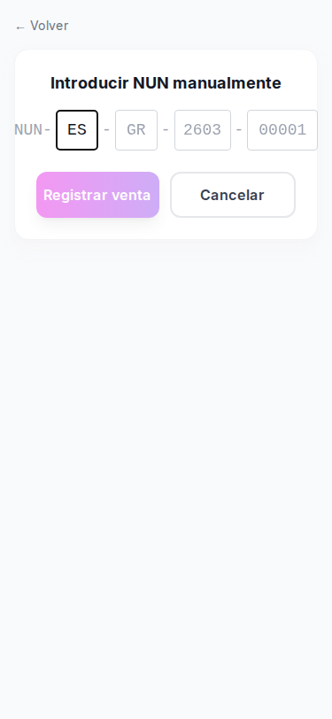

**Qué se ve:** "← Volver". Card con título "Introducir NUN manualmente". Label "NUN -" con 4 inputs segmentados: `ES` (con focus), `GR`, `2603`, `00001` con guiones entre ellos. CTAs: "Registrar venta" (gradiente pastel deshabilitado) + "Cancelar" outlined.

**Problemas:**
- ❌ **Label "NUN -" cortado a la izquierda:** el texto queda medio escondido fuera de la card. Bug de layout
- 🟡 **Inputs muy pequeños:** ~40px altura, ~48px width cada segmento — **debajo del mínimo 44px touch target** (especialmente "00001" que requiere 5 caracteres en 60px)
- 🟡 **4 inputs segmentados** es buena decisión UX (como iOS SMS code), pero:
  - No hay auto-advance visible (al escribir ES el focus NO parece saltar a GR automáticamente)
  - Sin validación en vivo (¿qué pasa si escribes ES-XX-9999-00001 inexistente?)
  - Sin teclado numérico forzado para 2603 y 00001 (debería ser `inputmode="numeric"`)
- ⚠️ **Placeholders en gris opaco** (`GR`, `2603`, `00001`) casi indistinguibles de texto escrito — mejorar contraste
- ⚠️ **CTA "Registrar venta" en gradiente pastel deshabilitado** — sin mensaje "Completa los 4 campos" o indicador de progreso
- ⚠️ **Sin preview del producto** antes de registrar — al completar ES-GR-2603-00001 debería mostrar `🎨 Albaicín Streets · mug · 9,97€ · Comisión 1,98€` antes de confirmar
- ⚠️ **"Cancelar" con mismo peso visual** que "Registrar venta" — podría ser link text
- ⚠️ Sin scanner de pegar (clipboard NUN) ni botón "Usar último escaneado"

---

## 5. Inventario (`/inventory`)

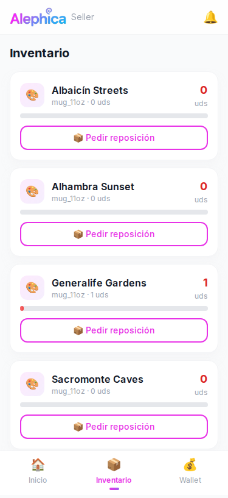

**Qué se ve:** Header Alephica + Seller + campana. Título "Inventario". Lista de 4 diseños (Albaicín Streets, Alhambra Sunset, Generalife Gardens=1uds, Sacromonte Caves). Cada card: icono paleta 🎨 rosa, nombre, "mug_11oz · 0 uds", contador rojo grande derecha ("0 uds" / "1 uds"), barra de progreso rosa (solo Generalife con fill mínimo), CTA outlined pink "📦 Pedir reposición" full-width.

**Problemas:**
- ❌ **Sin imagen real del diseño:** todos muestran emoji paleta 🎨 en círculo rosa pastel. Debería ser la thumbnail del diseño (consistente con Vendor/Central/Public)
- ❌ **Contador "0 uds" / "1 uds" en rojo** para todos los items, sin distinguir stock crítico vs OK. ¿Por qué 1 uds está en rojo? Semántica confusa
- 🟡 **Barra de progreso sin denominador:** muestra barra rosa solo en Generalife (1 uds) vacía en otros, pero sin número máximo ni escala — ¿qué representa?
- 🟡 **"mug_11oz" en snake_case** — debería ser "Taza 11oz"
- 🟡 **CTA "Pedir reposición" outlined pink full-width por row:** repetido 4 veces ocupa mucho espacio. Podría ser icono compacto (`+`) o swipe action
- 🟡 **Emoji 📦 en el botón** — Lucide `PackagePlus` o `RefreshCw`
- ⚠️ **Sin precio por unidad** ni comisión estimada — dato relevante para el dependiente
- ⚠️ **Sin búsqueda/filtro** (en una tienda real puede haber 20+ diseños)
- ⚠️ **Sin info de última reposición** ("Último pedido: hace 3 días")
- ⚠️ **Sin alerta visual** cuando stock=0 (debería tener borde rojo o badge "Agotado")
- ⚠️ **Icono paleta 🎨 genérico** no diferencia entre diseños — todos idénticos visualmente
- ✓ Layout card grande, touch-friendly
- ✓ Bottom nav "Inventario" activo claramente

---

## 6. Wallet (`/wallet`)

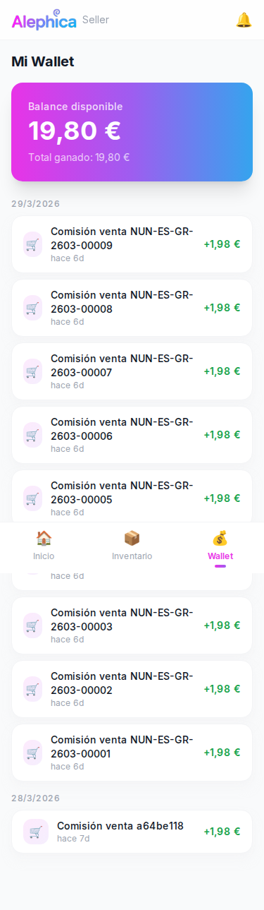

**Qué se ve:** Header + "Mi Wallet". Hero card gradiente "Balance disponible 19,80€" + "Total ganado: 19,80€". Groupers por fecha `29/3/2026` y `28/3/2026`. Lista de transacciones: icono 🛒 rosa, "Comisión venta NUN-ES-GR-2603-00009", "hace 6d", monto verde "+1,98€". Última transacción dice "Comisión venta **a64be118**" (UUID).

**Problemas:**
- ❌ **"Comisión venta NUN-ES-GR-2603-00009" — lenguaje de BD:** mismo problema que Home. Debería ser `Albaicín Streets · mug · 1,98€`
- ❌ **Última transacción "Comisión venta a64be118":** UUID hash truncado en vez de NUN — inconsistencia de formato. BUG de datos
- ❌ **Bottom nav overlapea transacciones:** se ve tapa de la row "NUN-2603-00004" a mitad del scroll
- 🟡 **Emoji 🛒 en cada transacción** — Lucide `ShoppingCart`
- 🟡 **Fecha `29/3/2026` / `28/3/2026`** formato DD/M/YYYY inconsistente. Debería ser `29 mar 2026` o `29/03/2026` (con padding)
- 🟡 **"hace 6d"** dentro de cada row + header "29/3/2026" — redundante. Si ya hay header de día, no hace falta relative time por row
- ⚠️ **Hero card gradiente grande:** muy similar a Vendor Wallet. "Pendiente" no aparece aquí (quizá no aplica al seller)
- ⚠️ **Sin filtros** (por fecha, por diseño, por tienda si el seller trabaja en varias)
- ⚠️ **Sin export CSV** ni vista detallada del movimiento
- ⚠️ **Todos los montos iguales (+1,98€):** la comisión es fija, pero visualmente monótono — podría mostrar "1,98€ (20% de 9,90€)" para contexto
- ✓ **Headers por día correctos** (mejor que Vendor Wallet que tenía fechas inconsistentes)
- ✓ Tipografía balance legible

---

## 7. Notificaciones (`/notifications`)

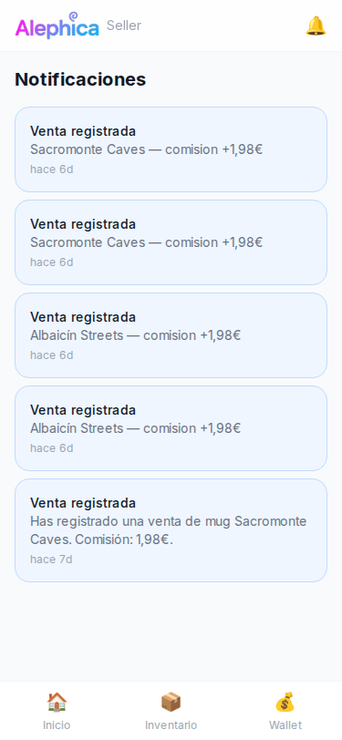

**Qué se ve:** Header + "Notificaciones". Lista de 5 cards con fondo azul claro, todas "Venta registrada" con texto `Sacromonte Caves — comision +1,98€` / `Albaicín Streets — comision +1,98€` / y una detallada `Has registrado una venta de mug Sacromonte Caves. Comisión: 1,98€.`. Timestamps "hace 6d" / "hace 7d".

**Problemas:**
- ❌ **Tildes faltantes:** `comision` → `comisión` (4 de las 5 notifs)
- ❌ **Inconsistencia de formato:** las primeras 4 dicen `Sacromonte Caves — comision +1,98€` (corto) y la última `Has registrado una venta de mug Sacromonte Caves. Comisión: 1,98€.` (largo, con tilde). Dos plantillas distintas para el mismo evento
- 🟡 **Todas las notifs son "Venta registrada":** sin tipos (nuevo stock, restock entregado, anuncio admin, cuenta suspendida...) — probablemente vacío por dataset seed
- 🟡 **Sin iconos semánticos** (todas planas texto con fondo azul) — Lucide `CheckCircle` verde para venta confirmada
- 🟡 **Fondo azul claro** sin precedente en el resto del branding (que es morado/rosa) — inconsistente
- 🟡 **Sin distinción leído/no-leído** (todas azul)
- ⚠️ **No hay acceso a Notificaciones desde bottom nav:** se accede vía campana del header — OK para app mobile, pero falta badge visible con contador
- ⚠️ **Sin acción por notif** (marcar leído individual, ir a detalle de venta)
- ⚠️ **Timestamps `hace 6d` / `hace 7d` sin fecha absoluta** — pasado 10d pierde precisión
- ⚠️ **Sin "Marcar todas como leídas"**

---

## 8. Bottom Nav States

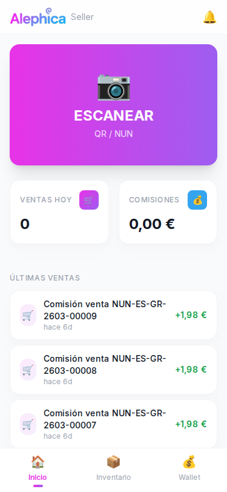
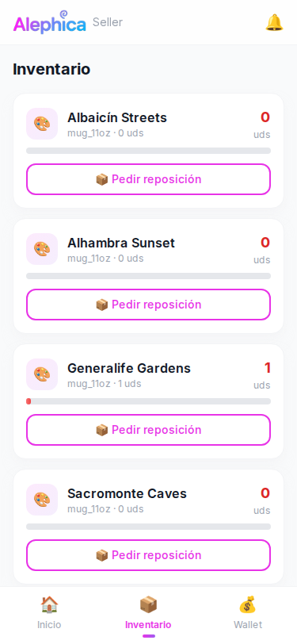
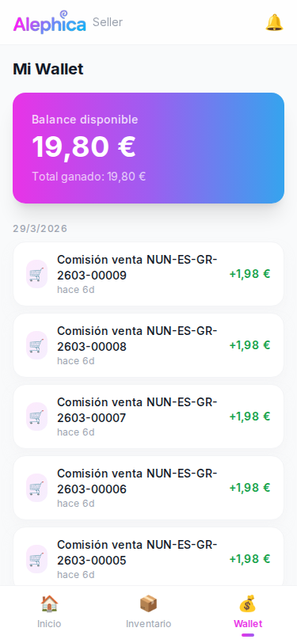

**Bottom Nav — 3 tabs:** Inicio 🏠 · Inventario 📦 · Wallet 💰

- ✓ **3 tabs limpios** (patrón correcto para app focada)
- ✓ **Tab activo:** emoji a color + label morada + underline morado
- ✓ **Tab inactivo:** emoji opacidad reducida + label gris
- ✓ **Altura ~70px** — touch target OK
- ❌ **Iconos son emojis nativos del sistema** (🏠 casa, 📦 caja, 💰 saco dinero) — inconsistencia visual entre dispositivos iOS/Android/web, deberían ser Lucide (`Home`, `Package`, `Wallet`)
- ⚠️ **Sin tab "Notificaciones"** en bottom nav — solo campana del header (decisión OK si badge es visible)
- ⚠️ **Sin tab "Ajustes"** ni botón "Cerrar sesión" visible en ninguna pantalla — **¿cómo cierra sesión el dependiente?** (problema grave)
- ⚠️ **Bottom nav sin blur backdrop ni separador superior claro** — se funde con el contenido en algunas pantallas

---

## 9. Desktop Adaptations

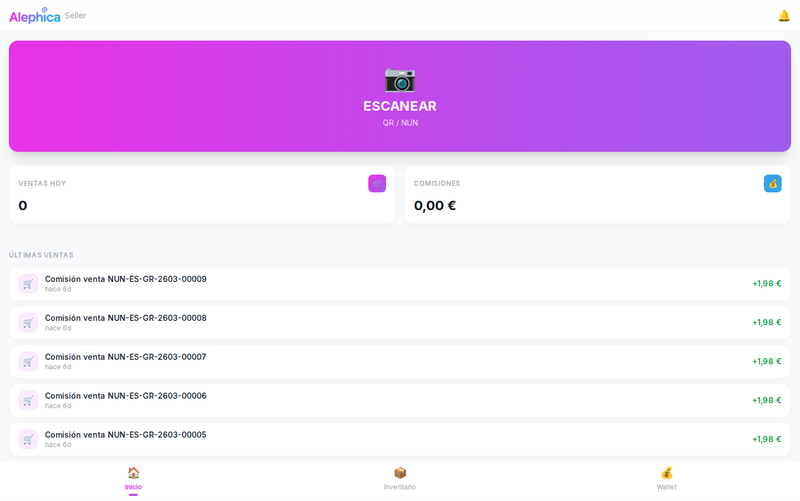
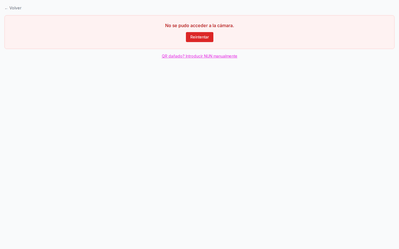
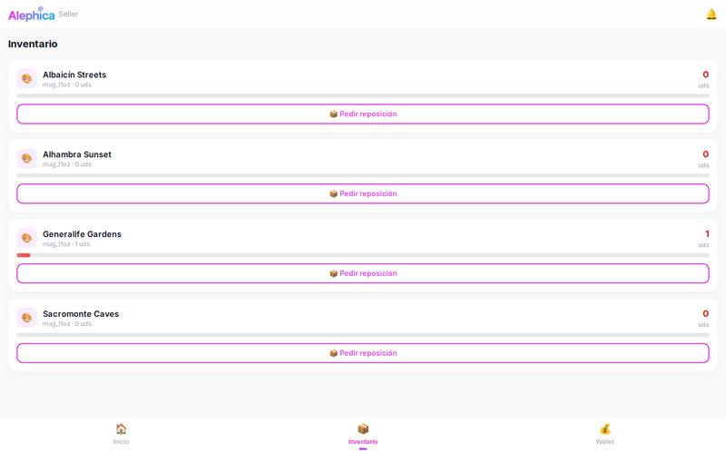
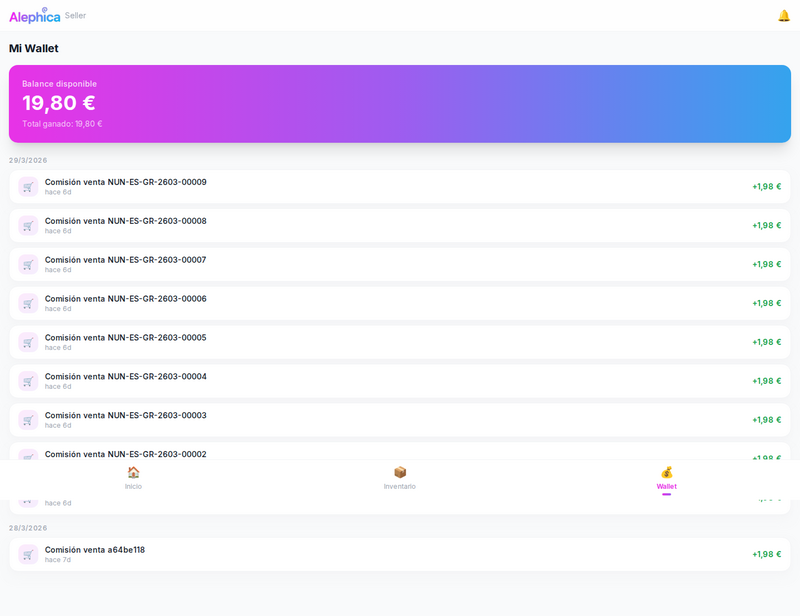

**Qué se ve:** La app se estira edge-to-edge en 1440px sin max-width. Hero "ESCANEAR" ocupa casi todo el ancho. Bottom nav 3 tabs espaciados horizontalmente con mucho aire entre ellos. Lista de transacciones full-width. Header logo pequeño arriba-izquierda.

**Problemas:**
- ❌ **Sin max-width:** la app está diseñada mobile-first pero se estira a 1440px. Debería limitarse a ~500px max-width centrado (patrón Instagram Web, Tinder Web)
- ❌ **Hero ESCANEAR estirado a 1440px** pierde identidad de "botón gigante" y parece banner
- ❌ **Bottom nav desktop con tabs separados 500px entre sí** — absurdo visualmente, los 3 iconos tan lejos que parece header disperso
- ❌ **Rows de transacciones full-width en desktop:** "Comisión venta NUN-XXX" pegado a la izquierda, monto a la derecha con 1200px de espacio vacío en medio
- 🟡 **Desktop ocupado por dependientes desde ordenador de la tienda:** caso de uso real (caja registradora con pantalla grande) — pero aún así debería centrarse con max-width
- ✓ La densidad de contenido es similar en desktop vs mobile (no añade info extra)

**Recomendación:** Añadir `max-width: 500px; margin: 0 auto` al root container + fondo neutro alrededor simulando marco de móvil.

---

## Resumen Totales

### Bugs Críticos (❌)
1. **Labels "Comisión venta NUN-ES-GR-XXX" — lenguaje BD:** en Home, Wallet y Notificaciones. Debería ser nombre del diseño
2. **Última transacción Wallet con UUID `a64be118`** en vez de NUN — inconsistencia de formato / bug de datos
3. **Tildes faltantes:** `comision` en notificaciones, `QR dañado?` sin `¿`
4. **Bottom nav overlapea contenido** en Home, Inventory, Wallet — falta padding-bottom
5. **Sin max-width desktop:** app se estira a 1440px, rompe diseño mobile-first
6. **Inventario sin imagen real** (todos con emoji paleta 🎨 genérico)
7. **"0 uds" / "1 uds" en rojo** indistintamente — semántica de stock confusa
8. **Scan sin estado "cámara activa" diseñado** — solo pantalla de error
9. **Label "NUN -" cortado** en manual entry
10. **Sin acceso a Logout / Ajustes** en ninguna pantalla — usuario atrapado
11. **Notificaciones con 2 plantillas** de formato para el mismo evento (corta vs larga)

### Issues de Diseño (🟡)
- **Emojis en todo:** 📷 hero, ✒️💰 KPIs, 🛒 transactions, 🎨 inventory, 📦 pedir reposición, 🏠📦💰 bottom nav — reemplazar por Lucide
- **CTA "Reintentar" en rojo** — debería ser brand morado
- **Fondo azul claro notificaciones** — fuera del brand morado/rosa
- **"mug_11oz"** en snake_case en múltiples pantallas
- **Fechas formato `29/3/2026`** sin padding ni separador localizado
- **Inputs manual entry < 44px** touch target
- **CTA "Pedir reposición" outlined pink** repetido por row — saturación visual
- **Bottom nav sin backdrop blur** — se funde con contenido

### Issues UX (⚠️)
- Home sin nombre de dependiente ni tienda en header
- Home KPIs sin delta vs ayer
- Scan sin viewfinder ni instrucciones ni onboarding de permisos
- Manual sin auto-advance entre inputs, sin preview del producto
- Manual sin teclado numérico forzado
- Inventario sin precio, sin búsqueda, sin filtros, sin fecha última reposición
- Wallet sin filtros, sin export, sin desglose comisión (solo monto neto)
- Notificaciones sin iconos, sin marcar-leído, sin filtros, sin tipos
- Campana header sin badge de notificaciones no leídas
- Sin página de Ajustes / Cerrar sesión
- "hace 6d" + header de día absoluto = redundante

---

## Top 5 Problemas Más Graves para Mobile UX

| # | Problema | Impacto | Prioridad |
|---|----------|---------|-----------|
| 1 | **Labels con NUN en vez de nombre de diseño** (Home, Wallet, Notifs) | El dependiente no puede identificar qué vendió sin mirar el producto físico. UX completamente roto para el caso de uso real | 🔴 Crítica |
| 2 | **Sin Logout / Ajustes visible** | Usuario atrapado en sesión; en tienda con varios dependientes, no se puede cambiar de usuario | 🔴 Crítica |
| 3 | **Scan sin estado "cámara activa"** ni onboarding de permisos | Flujo principal (escanear QR) roto en primera experiencia | 🔴 Crítica |
| 4 | **Bottom nav overlapea contenido** + sin max-width desktop | Content loss mobile + app rota visualmente en desktop | 🟠 Alta |
| 5 | **Inventario sin imagen real y con contador ambiguo** (todos rojos) | No se distingue stock OK de stock crítico; no hay identificación visual rápida | 🟠 Alta |

---

## Estimación Esfuerzo

| Categoría | Issues | Esfuerzo |
|-----------|--------|----------|
| **Fix labels BD → humanos** (Home, Wallet, Notifs) con nombre de diseño + lugar | Multi-página | ~1,5 días |
| **Ajustes/Logout UX** (página de settings accesible desde header o más tab) | Página nueva | ~1-1,5 días |
| **Scan — viewfinder + onboarding permisos + estado activo diseñado** | Flow crítico | ~2-3 días |
| **Bottom nav fix (padding + z-index)** | CSS | ~0,5 días |
| **Desktop max-width + frame** | CSS | ~0,5 días |
| **Inventario — imagen real + semáforo stock + precio + búsqueda** | Rediseño card | ~1,5 días |
| **Manual entry — auto-advance + teclado numérico + preview producto + label fix** | Refactor form | ~1 día |
| **Reemplazo emojis → Lucide** (hero, KPIs, transactions, inventory, bottom nav, pedir reposición) | ~12 iconos | ~0,5-1 día |
| **Notificaciones — unificar plantilla + tildes + iconos + tipos + marcar leído** | Refactor | ~1,5 días |
| **Wallet — fechas localizadas + desglose comisión + filtros** | Feature | ~1 día |
| **CTA colores brand + fondo notifs** (consistencia) | Design system | ~0,5 días |
| **Fix UUID `a64be118` en wallet** (bug de datos) | Backend fix | ~0,5 días |
| **QA i18n es-ES** (tildes, formatos fecha, snake_case) | Pass | ~0,5 días |
| **Total estimado** | | **~12-15 días** de 1 dev front |

---

## Sprints Propuestos

### Sprint 1 — Bloqueantes UX (1 semana)
- **Fix labels BD → nombre diseño + lugar** en Home/Wallet/Notifications
- **Página Ajustes + Cerrar sesión** accesible desde header
- **Bottom nav padding-bottom** + max-width desktop
- **Unificar plantilla notificaciones** + tildes (`comisión`)
- **Fix bug UUID en wallet** + formato de fecha localizado
- **Fix label "NUN -" cortado** en manual entry

### Sprint 2 — Flow Scan + Inventario (1 semana)
- **Scan: viewfinder + overlay + instrucciones + onboarding permisos cámara**
- **CTA Reintentar a brand color** (no rojo)
- **Manual entry: auto-advance + `inputmode="numeric"` + preview producto antes de confirmar**
- **Inventario: thumbnail real del diseño + semáforo stock (verde/ámbar/rojo) + precio + búsqueda**

### Sprint 3 — Design System + Polish (0,5-1 semana)
- **Reemplazar todos los emojis por Lucide** (hero, KPIs, transactions, inventory, bottom nav)
- **Campana header con badge contador** de notificaciones no leídas
- **Wallet: desglose comisión + filtros**
- **Notificaciones: iconos semánticos + marcar-leído + tipos diferenciados**
- **Header Home: nombre dependiente + tienda actual**
- **Fondo notifs: alinear con brand**

---

## DECISIÓN: ¿Redesign o Polish?

### **Polish + refactor moderado (no redesign completo)**

**Razones para NO hacer redesign:**
- ✓ El patrón core es correcto: **hero ESCANEAR gigante + bottom nav 3 tabs** es la arquitectura correcta para una app de dependiente (coincide con Uber/Glovo)
- ✓ Hero ocupa ~38% del viewport — bien dimensionado
- ✓ Bottom nav 3 tabs es el número correcto (no más, no menos)
- ✓ Wallet con groupers por día — mejor que Vendor
- ✓ Flow manual entry con inputs segmentados — decisión UX sólida
- ✓ Tipografía legible, touch targets mayormente OK (excepto inputs manual)

**Lo que falta es de refactor / features, no de arquitectura:**
- Labels humanos (no BD)
- Settings/Logout
- Scan flow completo (viewfinder)
- Max-width desktop
- Emojis → Lucide
- Inventario con imágenes reales
- Semáforo de stock

**Veredicto:** ~12-15 días de 1 dev front para dejarlo production-ready. **No requiere rediseño**.
