# Auditoría Visual — Vendor App

**URL:** https://vendor.alephica.eu
**Fecha:** 2026-04-04
**Viewport desktop:** 1440×900
**Viewport mobile:** 375×812
**Screenshots:** 19 (13 desktop + 6 mobile)

---

## 1. Login (`/login`)

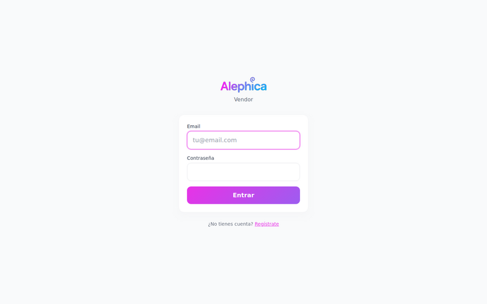

**Qué se ve:** Logo "Alephica" con badge "Vendor" en morado pill, card centrado con 2 inputs (Email, Contraseña), CTA gradiente "Entrar" y link "¿No tienes cuenta? Regístrate" debajo.

**Problemas:**
- ✓ Tildes correctas (`Contraseña`, `Regístrate`)
- ✓ Placeholder `tu@email.com` OK
- ⚠️ Centrado vertical bajo (formulario en tercio superior, mucho aire abajo)
- ⚠️ No hay link "¿Olvidaste tu contraseña?" — solo existe Regístrate
- ⚠️ Badge "Vendor" es un pill morado plano junto al logo; podría integrarse mejor (monocromo o neutral, no compite con la marca)
- ✓ Gradiente de marca bien aplicado al logo y CTA

**Mobile:** idéntico con mismo layout centrado. Buena adaptación.

---

## 2. Dashboard / Inicio (`/`)

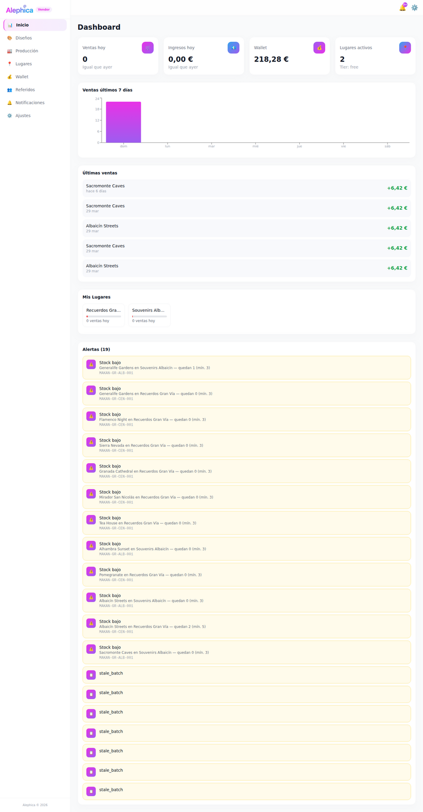

**Qué se ve:** Sidebar con 8 items (Inicio, Diseños, Producción, Lugares, Wallet, Referidos, Notificaciones, Ajustes) + badge "Vendor". Header con campana y engranaje. 4 KPI cards (Ventas hoy=0, Ingresos hoy=0,00€, Wallet=218,28€, Lugares activos=2). Gráfico "Ventas últimos 7 días" con una única barra gradiente. Lista "Últimas ventas" (5 rows: Sacromonte Caves / Albaicín Streets con +6,42€). "Mis Lugares" con 2 cards. "Alertas (19)" con 12 alertas stock bajo + 7 items `stale_batch` sin información.

**Problemas:**
- ❌ **BUG grave — `stale_batch` sin renderizar:** los últimos 7 items de Alertas muestran solo el string literal `stale_batch` sin título, descripción ni contexto. Falta un i18n key o un componente Alert para ese tipo
- ❌ **Tildes correctas** en labels principales (Últimas ventas, Producción, Notificaciones, etc.) ✓
- 🟡 **Emojis en KPI cards:** los 4 iconos circulares morados usan emojis (🛒, 💵, 👛, 📍) renderizados dentro de gradient circles. Inconsistente con un sistema de iconos Lucide
- 🟡 **Emoji ⚠️ en alertas:** todas las alertas de stock bajo usan icono triangular emoji en fondo gradiente morado — debería ser icono Lucide (`AlertTriangle`) con color semántico ámbar, no gradiente brand
- 🟡 **Gradiente overused:** sidebar item activo, 4 KPI icon circles, CTAs, chart bar, alert icons, wallet card — todo en gradiente morado/rosa. Reduce a 1-2 elementos focales
- ⚠️ **Gráfico "Ventas últimos 7 días" muy pobre:** una sola barra visible (dom), el resto del eje X vacío. Sin tooltip visible, sin leyenda, eje Y de 0 a 24 con labels 6/12/18/24 sin unidad
- ⚠️ **"Últimas ventas" solo muestra nombre de diseño:** no aparece el NUN del producto vendido ni el lugar donde se vendió. Datos insuficientes para reconciliar
- ⚠️ **"Mis Lugares" cards truncadas:** nombres "Recuerdos Gra..." y "Souvenirs Alb..." con ellipsis — más espacio disponible, width hardcodeado pequeño
- ⚠️ **Card "Lugares activos" con "Tier: free"** mezcla dato de plan con KPI de lugares — confuso
- ⚠️ **Sin acciones rápidas** desde dashboard (no botón "Crear lote", "Asignar stock", "Ver restocks pendientes")
- ⚠️ Jerarquía débil: "Dashboard" (h1) apenas más grande que "Últimas ventas" / "Mis Lugares" / "Alertas"

**Comparación Airbnb:** Airbnb usaría KPIs con números grandes sin iconos decorativos, gráficos con más respiración, y acciones inmediatas ("Añadir stock", "Revisar alertas") como botones primarios.

---

## 3. Catálogo de Diseños (`/designs`)

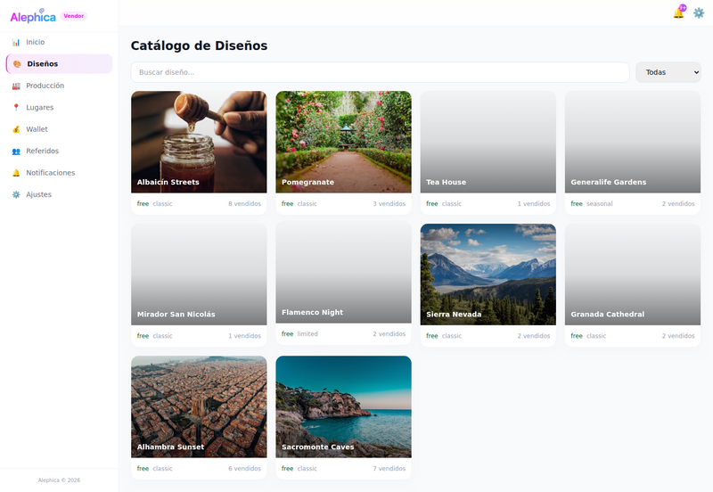

**Qué se ve:** Título "Catálogo de Diseños", search "Buscar diseño...", select "Todas" (filtro categoría), grid 4×3 con 10 diseños. Cada card: thumbnail + nombre overlay blanco abajo + chips "free classic N vendidos". Faltan thumbnails en Tea House, Generalife Gardens, Mirador San Nicolás, Flamenco Night, Granada Cathedral (placeholder gradiente gris).

**Problemas:**
- ❌ **5 diseños sin thumbnail:** mismo bug que en Central admin — Tea House, Generalife Gardens, Mirador San Nicolás, Flamenco Night, Granada Cathedral muestran gradiente gris vacío. Falta fallback decente (icono + nombre grande)
- 🟡 **Chips inconsistentes:** "free" / "classic" / "seasonal" / "limited" sin traducir ni con color semántico. Tier y categoría se mezclan visualmente
- ⚠️ **"N vendidos"** muestra número alineado a la derecha con tipografía más pequeña — podría ser más prominente (es la info clave para el vendor)
- ⚠️ **Texto blanco overlay sin gradiente oscuro base:** en imágenes claras (Pomegranate, Alhambra Sunset) el título es difícil de leer. Falta scrim/gradient overlay
- ⚠️ **Cards sin acción visible:** no CTA "Producir" o "Ver" — se asume click en toda la card, pero no hay pista
- ✓ Grid responsive, ratio consistente
- ✓ Search + filtro en la misma fila funciona

**Mobile:** grid 2×N, nombres overlay legibles excepto en thumbnails claros. Bottom nav sticky con 5 tabs (Inicio, Diseños, Producción, Lugares, Wallet) — Referidos/Notificaciones/Ajustes se pierden en mobile (no accesibles).

---

## 4. Diseño Detalle (`/designs/[id]`)

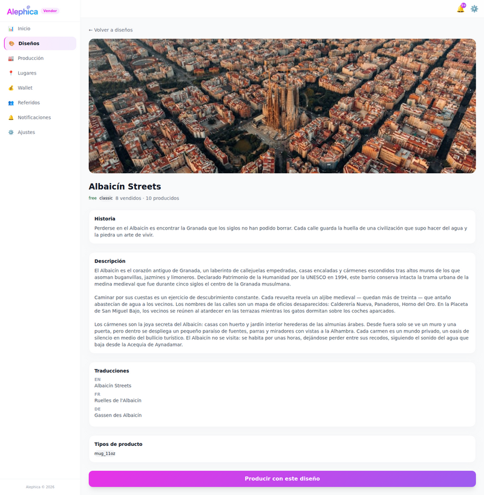

**Qué se ve:** Breadcrumb "← Volver a diseños". Hero image panorámica de Albaicín. Título "Albaicín Streets", metadata "free classic · 8 vendidos · 10 producidos". Secciones: Historia, Descripción (2 párrafos), Traducciones (EN, "Albaicín Streets", "Ruelles de l'Albaicín", "Gassen des Albaicín"), Tipos de producto (`mug_11oz`). CTA grande gradiente "Producir con este diseño".

**Problemas:**
- 🟡 **Metadata chips mezclan 3 conceptos:** `free` (tier), `classic` (categoría), `8 vendidos` (métrica), `10 producidos` (métrica) — separados por bullets pero sin agrupación visual
- 🟡 **Tipos de producto en snake_case:** `mug_11oz` — debería ser "Taza 11oz" o componente Badge más legible
- 🟡 **Traducciones como texto plano:** EN / Ruelles de l'Albaicín / Gassen des Albaicín — listados sin labels de idioma claros, sin flags, sin agrupación
- ⚠️ **"Historia" vs "Descripción"** — poco claro qué distingue ambas secciones (Historia está vacía/muy corta en el screenshot, Descripción ocupa la mayoría)
- ⚠️ **CTA sticky al fondo?** no queda claro si el botón hace scroll junto al contenido o es sticky
- ⚠️ Sin información de "veces producido" o "en stock en tus lugares"
- ✓ Hero image a sangre bien ejecutado
- ✓ Jerarquía tipográfica aceptable para detalle

---

## 5. Producción — Lista (`/production`)

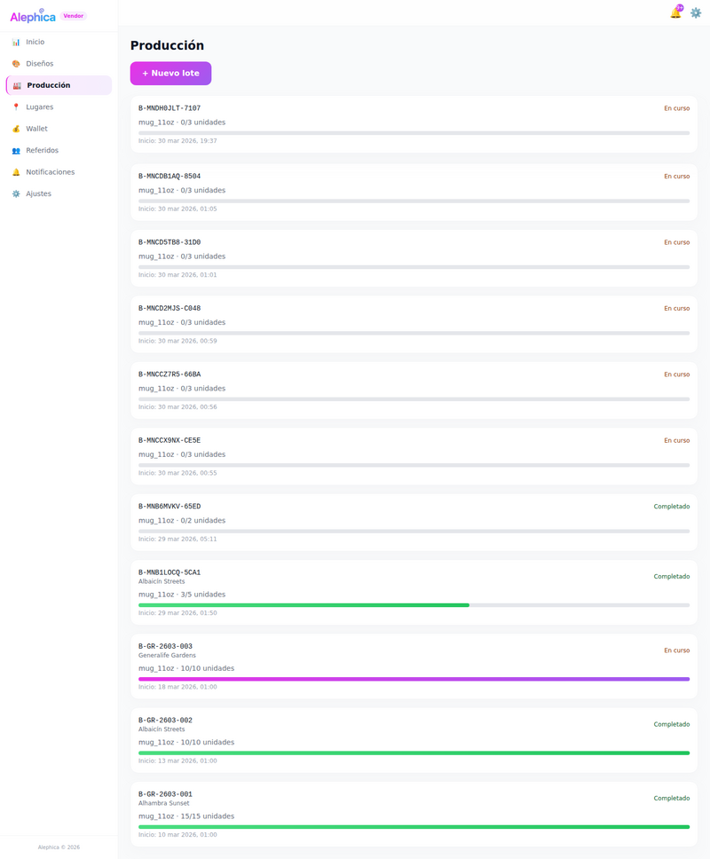

**Qué se ve:** Título "Producción", CTA "+ Nuevo lote" gradiente, lista de 11 lotes. Cada row: ID (`B-MNDH0JLT-7107`), tipo producto (`mug_11oz · N/M unidades`), status text derecha ("En curso"/"Completado"), barra de progreso, fecha inicio.

**Problemas:**
- ❌ **6 lotes en curso con 0/3 unidades y sin diseño asociado:** los batches B-MNDH..., B-MNCDB..., B-MNCD5..., B-MNCD2..., B-MNCCZ..., B-MNCCX... no muestran nombre de diseño (solo "mug_11oz"). Parece que se crearon sin diseño asignado — BUG de datos
- ❌ **Lote completado sin diseño:** B-MN86MVKV-65ED muestra "Completado 0/2" sin nombre de diseño — huérfano
- 🟡 **IDs de lote enormes:** `B-MNDH0JLT-7107` / `B-MNB1LOCQ-5CA1` — 14+ caracteres, font mono, dominan visualmente. Podría truncarse con tooltip
- 🟡 **Status en texto plano sin badge:** "En curso" naranja y "Completado" verde son solo texto, no pills/badges. Inconsistente con design systems modernos
- 🟡 **Barra de progreso sin etiqueta %:** la barra muestra colores distintos (gradiente morado cuando en curso con >0%, verde cuando completado, gris cuando 0%) pero sin número porcentual visible encima
- ⚠️ **"0/3 unidades" sin diseño** → no está claro qué se produce. UX confuso
- ⚠️ **Sin filtros** (por estado, diseño, fecha) y sin paginación visible
- ⚠️ **Sin acciones por row:** no hay "Marcar completado", "Cancelar lote" o "Añadir unidades" — toda la row clickable a detalle
- ✓ Fechas legibles ("30 mar 2026, 19:37")

---

## 6. Producción — Nuevo Lote (`/production/new`)

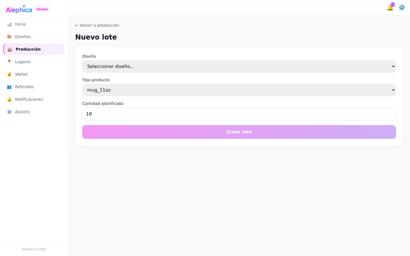

**Qué se ve:** Breadcrumb "← Volver a producción". Título "Nuevo lote". Form con 3 campos: Diseño (select "Seleccionar diseño..."), Tipo producto (select "mug_11oz"), Cantidad planificada (input=10). CTA gradiente "Crear lote" (aparece deshabilitado/opacado).

**Problemas:**
- 🟡 **Selects nativos HTML:** styling default del navegador, gris, sin consistencia con inputs del resto del sistema. Debería ser componente custom
- 🟡 **Único tipo producto disponible:** `mug_11oz` — el select no expone otras opciones (quizá solo hay una, pero sin label `Solo mug_11oz disponible`)
- ⚠️ **CTA opacado con gradiente pastel** — no queda claro si está deshabilitado porque falta diseño o porque es su estado normal. Sin mensaje "Selecciona un diseño para continuar"
- ⚠️ **Sin validación visible:** no hay hint del rango de cantidad (min/max), ni info de stock mínimo/máximo por lote
- ⚠️ **Sin preview** de lo que se va a producir (coste, tiempo estimado, etc.)
- ✓ Form mínimo y directo
- ✓ Labels correctamente en español con tildes

---

## 7. Producción — Detalle (`/production/[id]`)

**Qué se ve:** **Idéntico al screenshot 06** — el link "Editar" / detalle de lote abre `/production/new` en vez de mostrar el detalle del lote clickado.

**Problemas:**
- ❌ **BUG crítico:** el click en un lote de la lista navega a `/production/new` en lugar de `/production/[batchId]`. Misma regresión que en Central admin con diseños. Probablemente el `href` del row no tiene el ID
- ❌ **Sin página de detalle real:** no se puede ver estado por unidad, NUNs generados, historial de cambios, timeline del lote

---

## 8. Lugares — Lista (`/places`)

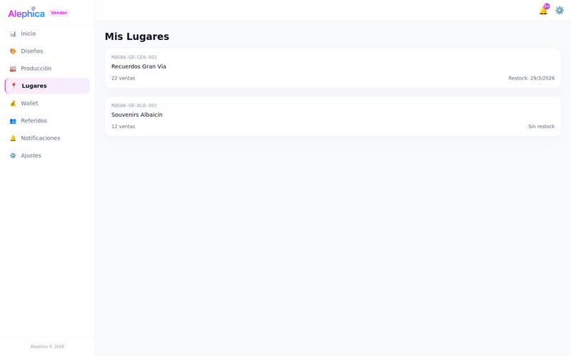

**Qué se ve:** Título "Mis Lugares". 2 cards: `MAKAN-GR-CEN-001 · Recuerdos Gran Vía · 22 ventas · Restock: 29/3/2026` y `MAKAN-GR-ALB-001 · Souvenirs Albaicín · 12 ventas · Sin restock`.

**Problemas:**
- 🟡 **ID MAKAN enorme en uppercase mono encima del nombre:** domina visualmente por encima del nombre real del lugar
- 🟡 **"Restock:" label** en inglés-friendly. Podría ser "Próximo restock" o "Último restock"
- ⚠️ **"Sin restock" en gris:** no queda claro si significa "nunca restockeado" o "no hay restock pendiente"
- ⚠️ **Sin KPIs por card:** ventas está pero falta revenue, stock actual, alertas
- ⚠️ **Sin CTA "Nuevo lugar"** en la vista (¿es admin-only?)
- ⚠️ **Cards muy espaciadas:** 2 items ocupan tercio vertical, resto en blanco — podría mostrar más info o compactarse
- ✓ IDs claros y consistentes

**Mobile:** idéntico, cards full-width con bottom nav sticky abajo.

---

## 9. Lugar Detalle (`/places/[id]`)

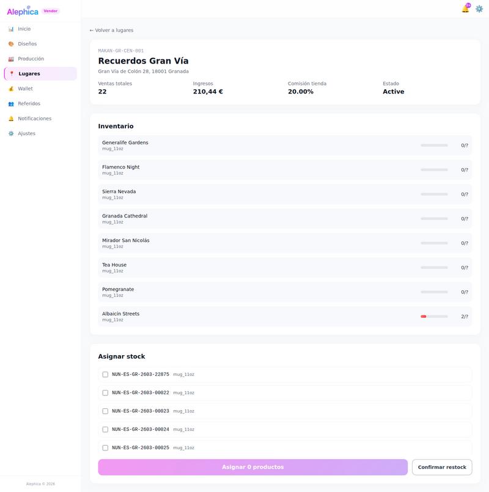

**Qué se ve:** Breadcrumb "← Volver a lugares". Header con ID MAKAN-GR-CEN-001, "Recuerdos Gran Vía", dirección "Gran Vía de Colón 28, 18001 Granada". 4 KPIs (Ventas totales=22, Ingresos=210,44€, Comisión tienda=20.00%, Estado=Active). Sección "Inventario" con 8 diseños (Generalife Gardens, Flamenco Night, Sierra Nevada, Granada Cathedral, Mirador San Nicolás, Tea House, Pomegranate, Albaicín Streets) — todos `mug_11oz · 0/?` excepto el último `2/?`. Sección "Asignar stock" con 5 checkboxes de NUNs. CTA "Asignar 0 productos" (deshabilitado) + "Confirmar restock" (outlined).

**Problemas:**
- ❌ **"Estado: Active" en inglés** — debería ser "Activo"
- ❌ **"0/?" en inventario** — el denominador `?` significa que no se conoce la capacidad máxima. Confuso para el vendor. Debería mostrar "0 unidades" o "Capacidad no definida"
- 🟡 **Comisión formateada raro:** `20.00%` con punto decimal (anglosajón) en lugar de `20,00%` (es-ES) o simplemente `20%`
- 🟡 **Barras de progreso inventario grises al 100% vacío:** todas las 7 filas con barra gris sin fill — no aporta info visual. Podría omitirse cuando max=?
- 🟡 **"mug_11oz"** repetido en cada row — información redundante
- 🟡 **"Asignar 0 productos"** botón con contador dinámico OK, pero deshabilitado con gradiente claro — difícil distinguir estado
- ⚠️ **"Confirmar restock" outlined al lado de CTA gradiente:** los dos botones con jerarquía confusa — cuál es la acción principal?
- ⚠️ **Sin timeline/historial de restocks** previos
- ⚠️ **NUNs de 14 caracteres** (`NUN-ES-GR-2603-22875`) con font mono dominan las rows de checkboxes
- ✓ KPI cards horizontales claras
- ✓ Dirección bien formateada

---

## 10. Wallet (`/wallet`)

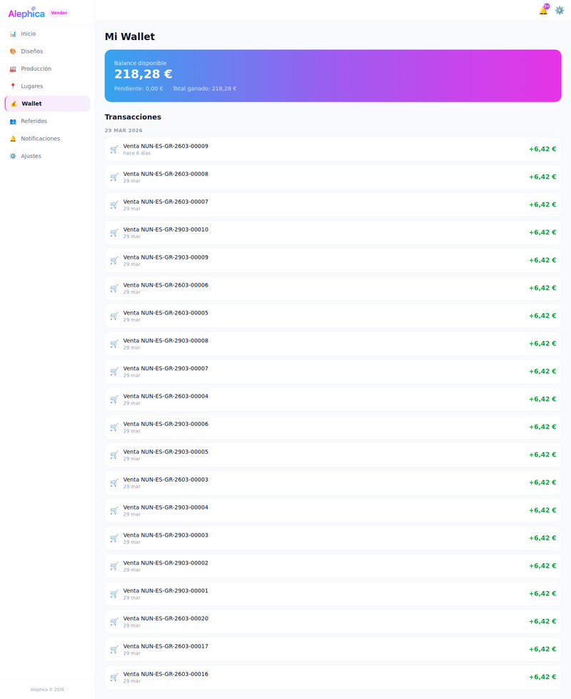

**Qué se ve:** Título "Mi Wallet". Hero card gradiente morado/rosa con "Balance disponible 218,28€" + "Pendiente: 0,00€ · Total ganado: 218,28€". Sección "Transacciones" con header de fecha "29 MAR 2026" y lista de 19 ventas (Venta NUN-XXX + fecha, monto +6,42€).

**Problemas:**
- ❌ **Todas las transacciones del mismo día `29 mar` (primera dice "hace 6 días"):** el grouper de fecha muestra "29 MAR 2026" pero la primera row dice "hace 6 días" → inconsistencia entre relative time y absolute time. Debería haber headers de fecha por día
- 🟡 **Emoji 🛒 en cada transacción:** icono de carrito emoji para cada venta — debería ser Lucide `ShoppingCart` o icono custom
- 🟡 **Solo muestra NUN sin diseño ni lugar:** el vendor no puede identificar qué se vendió ni dónde sin cruzar datos. Debería mostrar `Venta · Albaicín Streets en Recuerdos Gran Vía · NUN-...`
- 🟡 **Montos todos idénticos (+6,42€):** sin variación — correcto si todos los productos tienen el mismo precio, pero visualmente monótono
- ⚠️ **Sin filtros** (por fecha, por lugar, por diseño)
- ⚠️ **Sin export / descargar CSV**
- ⚠️ **Sin desglose de comisiones** visible en cada transacción (solo el neto +6,42€)
- ⚠️ **Hero card gradiente muy grande:** podría ser más compacto o dividir Balance/Pendiente/Total en 3 cards
- ⚠️ **"Pendiente: 0,00€"** sin tooltip explicando qué es pendiente (ventas no liquidadas, retenciones, etc.)
- ✓ Tipografía de balance grande y legible

**Mobile:** bottom nav overlapea rows de transacciones (visible a mitad del scroll) — falta `padding-bottom` en el contenedor de la lista.

---

## 11. Referidos (`/referrals`)

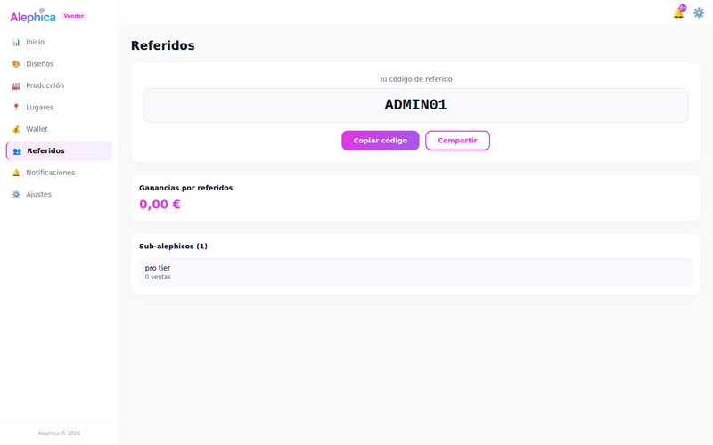

**Qué se ve:** Título "Referidos". Card grande con "Tu código de referido" centrado + código mono "ADMIN01" grande + 2 botones (Copiar código gradiente / Compartir outlined). Card "Ganancias por referidos" con "0,00€" en morado. Card "Sub-alephicos (1)" con "pro tier · 0 ventas".

**Problemas:**
- 🟡 **"ADMIN01" como código de referido** — literalmente el username del admin. No parece un código de referral real
- 🟡 **"Sub-alephicos" en lowercase-mixed:** palabra inventada con casing raro. ¿Naming intencional? Podría ser "Mis referidos (1)"
- 🟡 **"pro tier" lowercase sin tilde:** debería ser "Tier Pro" o badge con casing consistente
- ⚠️ **Sin explicación del programa:** no hay texto "Gana X% por cada referido", "Condiciones", "Términos" — el usuario llega frío
- ⚠️ **Sin tabla de histórico de ganancias** (solo muestra 0,00€ total)
- ⚠️ **Card "Sub-alephicos" con 1 item muy escueto:** falta fecha de alta, status, próximo payout
- ✓ Botones Copiar/Compartir acción clara
- ✓ Código mono destacado correctamente

---

## 12. Notificaciones (`/notifications`)

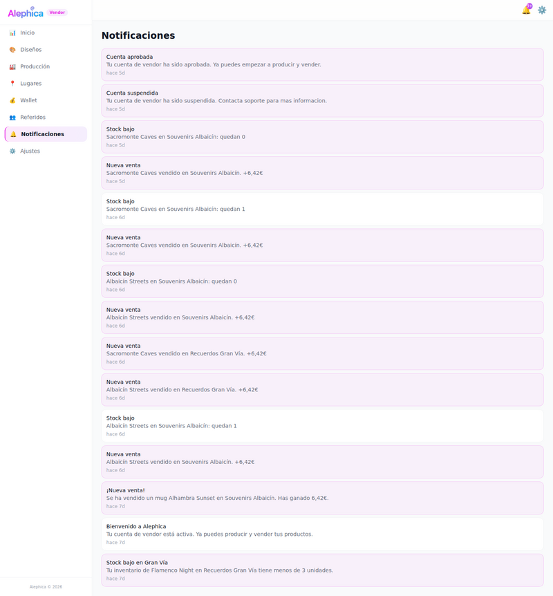

**Qué se ve:** Título "Notificaciones". Lista de ~16 notificaciones con fondo rosa claro (las recientes) y blanco (las leídas). Tipos: "Cuenta aprobada", "Cuenta suspendida", "Stock bajo", "Nueva venta", "¡Nueva venta!", "Bienvenido a Alephica", "Stock bajo en Gran Vía".

**Problemas:**
- ❌ **Tildes faltantes:** `Contacta soporte para mas informacion` → `Contacta soporte para más información` (notificación "Cuenta suspendida")
- 🟡 **Sin iconos por tipo:** todas las notifs tienen el mismo layout plano sin diferenciación visual entre "Cuenta suspendida" (crítica), "Stock bajo" (warning), "Nueva venta" (positiva), "Bienvenido" (info). Deberían tener icono Lucide + color semántico
- 🟡 **Fondo rosa claro para unread:** muy sutil, difícil distinguir de leído
- 🟡 **Inconsistencia de tono:** "¡Nueva venta!" con exclamaciones y luego "Nueva venta" sin — mismos eventos con 2 formatos distintos
- ⚠️ **Sin acción por notificación:** no se puede marcar como leído individualmente, ni archivar, ni ir a detalle
- ⚠️ **Sin filtros** (por tipo, no leídas, fecha)
- ⚠️ **Sin botón "Marcar todas como leídas"** global
- ⚠️ **Timestamps "hace 5d" / "hace 6d" / "hace 7d":** sin fecha absoluta, tras 10d pierde precisión
- ⚠️ **Campana del header con badge 9+** — coincide con el count pero no hay número total en la página
- ⚠️ Mensajes truncados sin expand

---

## 13. Ajustes (`/settings`)

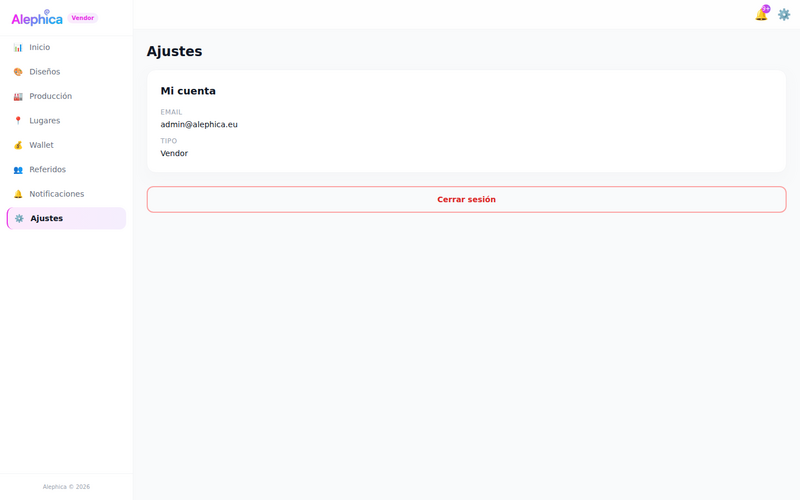

**Qué se ve:** Título "Ajustes". Card "Mi cuenta" con label EMAIL=`admin@alephica.eu` y TIPO=`Vendor`. Botón "Cerrar sesión" (rojo outlined full-width).

**Problemas:**
- ❌ **Página casi vacía:** solo 2 campos read-only + logout. Falta:
  - Editar nombre, teléfono, foto de perfil
  - Cambiar contraseña
  - Preferencias de notificaciones (email/push/in-app)
  - Idioma (ES/EN/FR/DE)
  - Datos bancarios para payouts
  - Datos fiscales/factura
- 🟡 **"TIPO: Vendor"** — información innecesaria para el usuario (ya lo sabe)
- 🟡 **Labels EMAIL / TIPO en uppercase sin sentido:** podrían ser "Email" y eliminar "Tipo"
- ⚠️ **"Cerrar sesión" rojo full-width demasiado prominente:** parece destructivo primario cuando debería ser secundario
- ⚠️ Sin link a "Eliminar cuenta" ni "Exportar datos" (GDPR)

---

## 14. Mobile (375px)

Bottom nav sticky con 5 tabs: **Inicio · Diseños · Producción · Lugares · Wallet**. Header simple con logo + campana + engranaje. No hamburger.

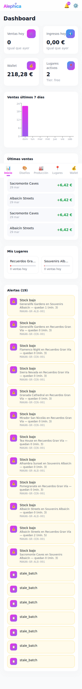
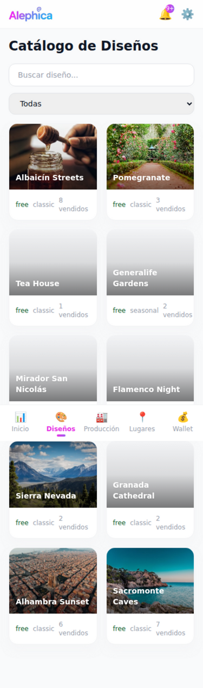
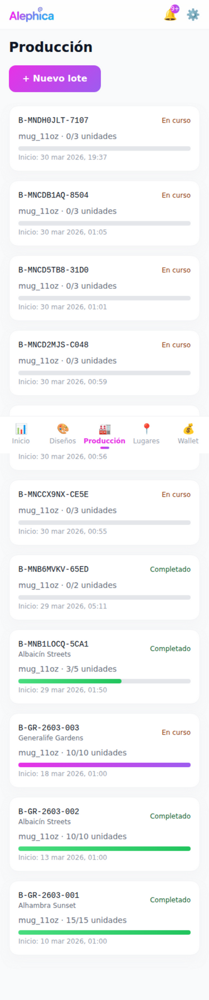
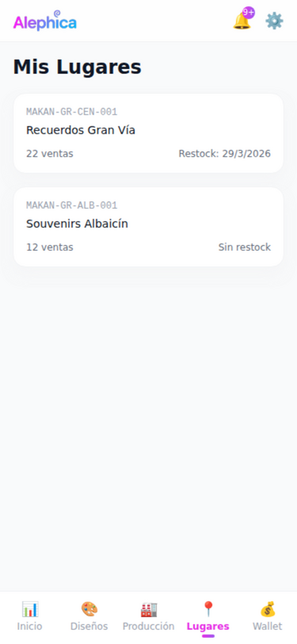
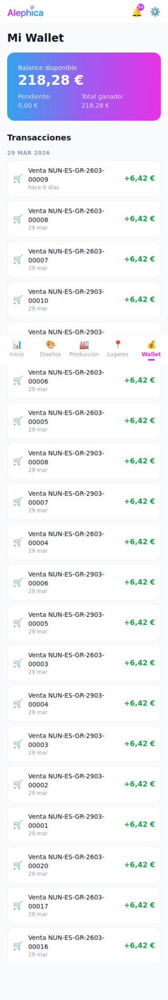

**Bottom nav:**
- ✓ Patrón correcto (bottom tab bar estándar mobile)
- ✓ Activo con label en morado + underline
- ❌ **Solo 5 de 8 secciones:** Referidos, Notificaciones, Ajustes NO accesibles desde mobile nav. Necesitan un "More" tab o acceso desde engranaje/campana del header
- 🟡 **Iconos con emojis** (🏭 producción, 📍 lugares, 👛 wallet, 🎨 diseños, 📊 inicio) — Lucide consistente
- ❌ **Bottom nav OVERLAPEA contenido:** visible en dashboard, production, wallet — las últimas rows quedan tapadas. Falta `padding-bottom: 80px` en el main container

**Dashboard mobile:**
- ✓ KPI cards 2×2 stack bien
- ⚠️ "Alertas (19)" con 19 rows + 7 stale_batch = página muy larga sin paginación

**Diseños mobile:**
- ✓ Grid 2 columnas, cards con overlay legible
- ⚠️ Títulos 2-line ("Generalife Gardens", "Mirador San Nicolás") rompen grid visual

**Producción mobile:**
- ⚠️ IDs `B-MNDH0JLT-7107` cortan el layout (font mono grande en pantalla pequeña)
- ⚠️ Status "En curso" / "Completado" en esquina — legible

**Lugares mobile:**
- ✓ Cards funcionan bien, mucho whitespace disponible
- ⚠️ Bottom nav no overlapea aquí (solo 2 items)

**Wallet mobile:**
- ⚠️ Hero card gradiente OK
- ⚠️ NUN-ES-GR-2603-00009 font mono corta a 2 líneas en algunas rows — apretado

---

## Resumen Totales

### Bugs Críticos (❌)
1. **`stale_batch` sin renderizar** en Alertas dashboard (7 items muestran string literal)
2. **Detalle de lote roto** — click en lote navega a `/production/new` en vez de `/production/[id]`
3. **6+ lotes de producción sin diseño asociado** — data orphans
4. **5 diseños sin thumbnail** (mismo bug que Central)
5. **Bottom nav mobile overlapea contenido** (falta padding-bottom)
6. **3 secciones inaccesibles en mobile:** Referidos, Notificaciones, Ajustes
7. **Inconsistencia fecha wallet:** "hace 6 días" bajo header "29 MAR 2026"
8. **"Estado: Active"** sin traducir en lugar detalle
9. **Inventario muestra "0/?"** — capacidad máx desconocida
10. **Tildes faltantes en notificación** "para mas informacion"

### Issues de Diseño (🟡)
- **Gradiente overused:** sidebar, KPIs, alertas, CTAs, hero wallet, chart bar — saturación
- **Emojis vs Lucide:** KPI circles (🛒💵👛📍), alertas (⚠️), wallet (🛒), bottom nav (🎨🏭📍👛) — reemplazar por Lucide
- **Selects nativos HTML** (production/new) sin styling consistente
- **IDs mono muy largos** (`B-MNDH0JLT-7107`, `NUN-ES-GR-2603-22875`, `MAKAN-GR-CEN-001`) dominan layouts
- **Chips sin color semántico** (free/classic/seasonal/limited mezclan tier y categoría)
- **Status en texto plano** ("En curso"/"Completado") debería ser Badge pill
- **"pro tier"** lowercase inconsistente con resto del UI
- **Badge "Vendor"** junto a logo compite con la marca

### Issues UX (⚠️)
- Dashboard sin acciones rápidas
- Últimas ventas sin NUN/lugar; Wallet con NUN sin diseño/lugar — información fragmentada
- Producción sin filtros ni paginación; sin acciones por row
- Wallet sin export, sin desglose de comisiones, sin filtros
- Ajustes casi vacío (sin editar perfil, contraseña, notificaciones, idioma, payout)
- Referidos sin explicación del programa
- Notificaciones sin filtros, sin marcar-leído individual, sin iconos semánticos
- Chart "Ventas 7 días" muy pobre (1 barra visible)
- Jerarquía tipográfica débil — H1s apenas más grandes que H2s
- Lugar detalle: comisión `20.00%` (en-US) en vez de `20,00%` (es-ES)

---

## Top 5 Páginas con Más Problemas

| # | Página | Críticos | Diseño | UX | Prioridad |
|---|--------|----------|--------|-----|-----------|
| 1 | **Dashboard** | stale_batch, emojis KPI, chart pobre | Gradiente overused, jerarquía débil | Sin acciones, datos fragmentados | 🔴 Alta |
| 2 | **Producción (lista + detalle)** | Detalle roto, lotes sin diseño | IDs mono dominan, status texto | Sin filtros, sin acciones | 🔴 Alta |
| 3 | **Lugar Detalle** | "Active" sin traducir, "0/?" | Comisión en-US, 2 CTAs confusos | Sin historial restocks | 🟠 Media |
| 4 | **Wallet** | Fecha inconsistente, emoji carrito | Hero muy grande, NUN sin contexto | Sin export, sin filtros, sin comisión | 🟠 Media |
| 5 | **Ajustes** | — | "TIPO" redundante | Página casi vacía (falta edit, password, payout, idioma) | 🟠 Media |

---

## Estimación Esfuerzo

| Categoría | Issues | Esfuerzo |
|-----------|--------|----------|
| **Bugs críticos** (stale_batch, routing detalle lote, thumbnails, data orphans, "Active", "0/?", fecha wallet, overlap mobile nav) | 10 | ~3-4 días |
| **Reemplazo emojis → Lucide** (KPIs, alertas, wallet, bottom nav) | ~15 iconos | ~1 día |
| **Reducción gradiente + color semántico** (badges, alertas ámbar, CTA jerarquía) | Sistema | ~2 días |
| **Select custom + componentes Badge** | 3-4 componentes | ~1-2 días |
| **Ajustes — formulario completo** (editar perfil, pass, idioma, payout, notifs) | Página nueva | ~2-3 días |
| **Ajustes mobile — acceso a Referidos/Notificaciones/Ajustes** (More tab o header menu) | Nav | ~0,5 días |
| **Dashboard — acciones rápidas + chart mejorado** | Rediseño parcial | ~1-2 días |
| **Wallet — filtros, export, desglose comisión, fecha groupers** | Feature | ~2 días |
| **Producción — filtros, paginación, acciones, detalle real** | Feature | ~2-3 días |
| **i18n — es-ES consistente** (tildes, 20,00%, "Activo", traducir chips free/classic/etc) | QA pass | ~1 día |
| **Mobile padding + truncation fixes** | CSS | ~0,5 días |
| **Total estimado** | | **~16-22 días** de 1 dev front |

---

## Sprints Propuestos

### Sprint 1 — Bugs Bloqueantes (1 semana)
- Fix routing `/production/[id]` (detalle roto)
- Fix render `stale_batch` en alertas
- Fix thumbnails diseños (fallback icon+nombre)
- Fix bottom nav overlap mobile (padding-bottom)
- Fix fecha wallet (groupers por día)
- Traducir "Active" → "Activo", "20.00%" → "20,00%"
- Investigar lotes huérfanos sin diseño (¿UI muestra mal o dato corrupto?)
- Acceso mobile a Referidos/Notificaciones/Ajustes (More tab)

### Sprint 2 — Design System (1 semana)
- Reemplazar todos los emojis por Lucide (KPIs, alertas, wallet, bottom nav)
- Componente Badge (status lotes, tier, categoría con color semántico)
- Componente Select custom (reemplaza nativo)
- Reducir uso de gradiente a CTAs primarios + hero wallet únicamente
- Alertas con color ámbar/destructive, no gradiente brand
- Jerarquía tipográfica (H1 más prominente)

### Sprint 3 — Features Vendor (1-1,5 semanas)
- Ajustes: formulario completo (perfil, contraseña, idioma, payout, preferencias notifs)
- Wallet: filtros + export CSV + desglose comisión + info en cada transacción (diseño+lugar)
- Dashboard: acciones rápidas + chart 7 días con datos reales + Últimas ventas con contexto completo
- Producción: filtros/paginación + detalle real de lote (timeline, NUNs generados)
- Notificaciones: filtros, marcar-leído, iconos semánticos, fecha absoluta

### Sprint 4 — Polish (0,5 semanas)
- Lugar detalle: historial restocks, resolver "0/?" con capacidad real
- Referidos: explicación del programa, tabla histórica
- QA i18n es-ES completo
- Accessibility pass (hover/focus/aria)
- Mobile: fix truncation de títulos/IDs
