# Auditoría Visual — Web Pública

**URL:** https://alephica.eu
**Fecha:** 2026-04-05
**Viewport primario:** 1440×900 (desktop — landing marketing)
**Viewport secundario:** 375×812 (mobile) + 768×1024 (tablet)
**Screenshots:** 27 (14 desktop + 7 mobile + 2 tablet + 4 SEO/404)

Web pública es **la puerta de entrada de Alephica**: landing de marketing, catálogo de diseños, páginas QR/NUN (la "historia" del producto al escanear) y 404s. Auditar como sitio marketing-first con foco en **Hero + narrativa + conversión**, y el flujo QR como **experiencia post-compra** (distinta, editorial, tipo pergamino).

---

## 1. Landing — Hero (`/`)

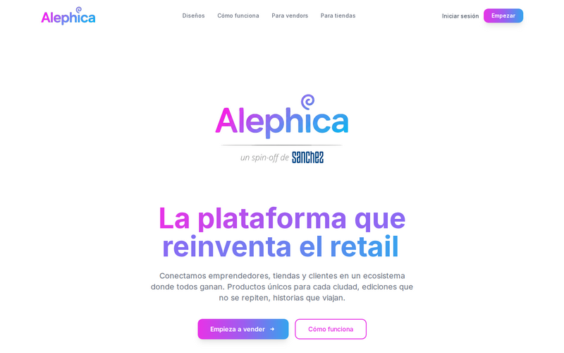

**Qué se ve:** Navbar slim con logo gradiente "Alephica" (con `@` superscript decorativo) + 4 links (Diseños, Cómo funciona, Para vendors, Para tiendas) + "Iniciar sesión" + CTA "Empezar" morado. Hero centrado: logo grande "Alephica@" repetido, subtítulo "un spin-off de **sanchez**", claim H1 bicolor "La plataforma que reinventa el retail" (magenta→morado→azul), descripción "Conectamos emprendedores, tiendas y clientes...", 2 CTAs: "Empieza a vender →" (gradiente) + "Cómo funciona" (outlined rosa).

**Problemas:**
- 🟡 **"Alephica@" con `@` superscript:** el símbolo arroba en superíndice es visualmente ambiguo (¿email? ¿handle social?). No es distintivo como logotipo de marca — podría confundirse con ruido tipográfico
- 🟡 **"un spin-off de sanchez"** — ¿qué es Sanchez? Sin link, sin contexto, sin tooltip. Para un visitante frío esto es ruido. Si es endoso corporativo, debería decir "Powered by Sanchez" o enlazar al sitio
- 🟡 **Claim con anglicismo "el retail":** mezcla ES+EN. Alternativas: "el comercio", "la venta física", "el retail" (mantener pero entonces alinear con "Para vendors")
- ⚠️ **Logo duplicado:** navbar tiene "Alephica" + hero tiene "Alephica" gigante inmediatamente debajo. Repetición redundante en mismo viewport
- ⚠️ **Hero muy vacío verticalmente:** el claim empieza ~360px bajo el top, con mucho aire entre logo y claim. Above-the-fold desaprovechado
- ⚠️ **Sin preview visual** de productos / diseños / vendors en hero — todo texto. Un marketplace necesita imagen en above-the-fold
- ⚠️ **Sin badge social proof** (nº de vendors, nº de ciudades, nº de diseños) — típico en hero de marketplaces
- ⚠️ **CTA secundario "Cómo funciona" outlined rosa** compite visualmente con el primario por saturación de color
- ✓ Gradiente del H1 bien ejecutado, colores brand coherentes
- ✓ Jerarquía tipográfica clara (H1 > descripción > CTAs)

---

## 2. Navbar

**Qué se ve:** Navbar full-width slim, logo izquierda, 4 menu items centro, 2 CTAs derecha.

**Problemas:**
- ❌ **"Para vendors" mezcla inglés con "Para tiendas" español:** inconsistencia de naming. O ambos en ES (`Para emprendedores` / `Para tiendas`) o ambos en EN (`For vendors` / `For shops`). Nunca mezclar
- 🟡 **Sin idioma toggle** en la landing (aunque QR pages sí lo tienen) — inconsistencia del sistema multilingüe
- 🟡 **2 CTAs navbar "Iniciar sesión" + "Empezar":** ambiguo — ¿"Iniciar sesión" es para vendors o clientes? ¿"Empezar" es signup de vendor o de tienda? Sin segmentación
- ⚠️ **Sin sticky behavior visible** (no se puede evaluar en screenshot estático, pero conviene verificar)
- ⚠️ **Logo sin link explícito `aria-label`** — verificar accesibilidad
- ✓ Altura ~45px slim, no invasivo
- ✓ CTA "Empezar" con gradiente destacado del resto

---

## 3. Landing — Pillars ("Un ecosistema que funciona")

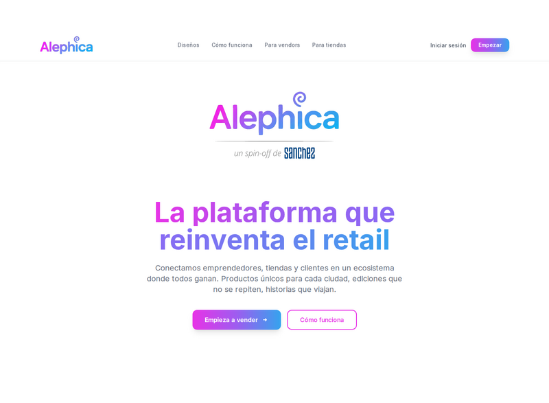

**Qué se ve:** Título H2 gradiente "Un ecosistema que funciona" + subtítulo "Tres ingredientes que hacen de Alephica un modelo único". 3 cards iguales con icono en cuadrado color, título bold, descripción gris y pill color debajo:
1. **Diseños IA** (icono sparkle morado) — "Cada diseño es generado por IA y personalizado para una ciudad, zona o contexto..." + pill morado "∞ diseños posibles"
2. **Economía colaborativa** (icono people azul) — "Vendors autónomos producen y distribuyen. Tiendas existentes venden. Sin inversión en locales ni empleados." + pill azul "Sin local propio"
3. **Único en espacio y tiempo** (icono reloj morado claro) — "Los diseños son exclusivos de cada ciudad y rotan periódicamente. Escasez real que genera valor y urgencia de compra." + pill morado "Ediciones limitadas"

**Problemas:**
- 🟡 **Iconos en cuadrado con color de fondo:** los 3 cuadrados tienen colores distintos (morado, azul, morado claro) pero sin patrón claro — ¿por qué ese reparto?
- 🟡 **"∞ diseños posibles"** — el símbolo infinito junto a "diseños posibles" promete algo no-verificable. Un comprador/inversor exige cifras concretas ("+500 diseños generados")
- ⚠️ **"Vendors" en inglés** en card 2 — mismo problema que navbar
- ⚠️ **Descripciones desbalanceadas en longitud** (card 1 es más corta que 2 y 3)
- ⚠️ **Sin imagen real ni screenshot** que ilustre cada pilar — solo icono abstracto
- ⚠️ **Título "Un ecosistema que funciona"** es telling, no showing. Mejor: "Así funciona Alephica" con step 1-2-3 numerado
- ✓ Layout 3 columnas clean, respira bien
- ✓ Colores brand consistentes

---

## 4. Landing — Street Videos ("Alephica en la calle")

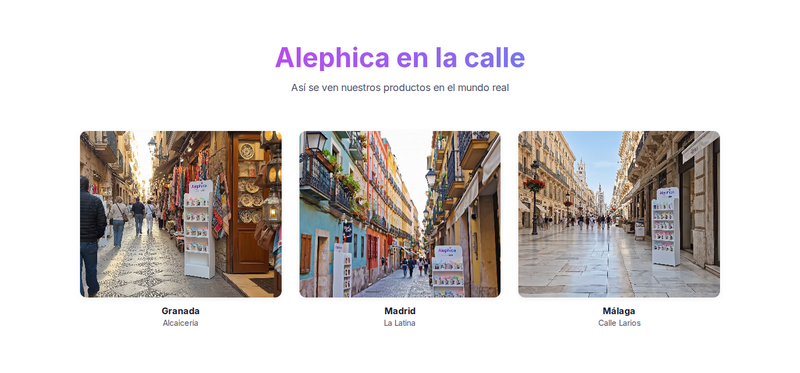

**Qué se ve:** Título "Alephica en la calle" + subtítulo "Así se ven nuestros productos en el mundo real". Grid 3 columnas con fotos de calles comerciales: **Granada — Alcaicería**, **Madrid — La Latina**, **Málaga — Calle Larios**.

**Problemas:**
- ❌ **Bait-and-switch de expectativa:** el subtítulo promete "así se ven NUESTROS PRODUCTOS en el mundo real" pero las 3 fotos son **fotos de calles comerciales genéricas sin ningún producto Alephica visible**. El usuario espera ver tazas/camisetas Alephica en escaparates reales y ve paisaje urbano
- ❌ **Título "en la calle" + subtítulo "mundo real" = promesa de prueba social falsa:** no hay evidencia visible de que Alephica esté en esas calles. Es visualmente engañoso
- 🟡 **Sección llamada "street-videos"** internamente pero muestra **fotos estáticas** — sin reproducción de vídeo (contradicción nombre/contenido)
- 🟡 **Solo 3 ciudades españolas** (Granada, Madrid, Málaga) — si el MVP es Granada, la inclusión de Madrid/Málaga como si existieran puede ser prematura
- ⚠️ **Sin links "Ver diseños de Granada/Madrid/Málaga"** — oportunidad perdida de llevar al catálogo geolocalizado
- ⚠️ **Cards sin shadow ni hover state visible** en screenshot
- ✓ Fotos de buena calidad, composición uniforme

**Recomendación:** sustituir por **vídeos cortos (5-10s) de tazas Alephica en escaparates reales** o generar con IA mockups integrando producto en foto real. El nombre promete vídeos, entonces deben ser vídeos.

---

## 5. Landing — Vendor Kit ("El kit del vendor")

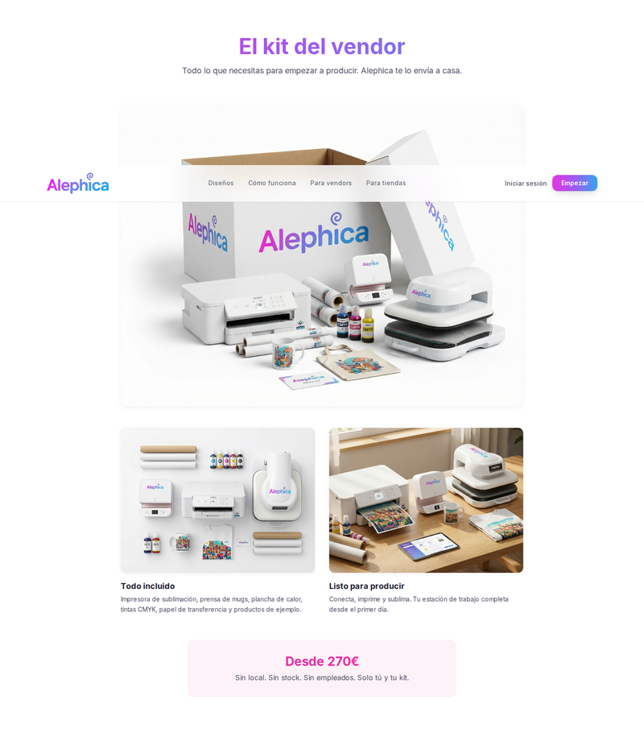

**Qué se ve:** H2 "El kit del vendor" + subtítulo "Todo lo que necesitas para empezar a producir. Alephica te lo envía a casa." Imagen hero grande: caja abierta con logo Alephica, impresora sublimación, prensa térmica, tazas, etc. 2 cards abajo: "**Todo incluido**" (Impresora de sublimación, plancha de mugs, planchas de calor, tintas CMYK, papel de transferencia y productos de ejemplo) y "**Lista para producir**" (Conecta, imprime y sublima. Tu estación de trabajo completa desde el primer día.). Al final: card rosa pálido con "Desde **270€**" (precio grande morado) + "Sin local. Sin stock. Sin empleados. Solo tú y tu kit."

**Problemas:**
- 🟡 **"Para vendors"** se repite (título "El kit del vendor" en ES con anglicismo). Consistencia de naming
- 🟡 **Imagen hero del kit:** la marca "Alephica" aparece 3 veces en la caja/paquete — saturación de logo. Mock-up de producto over-branded
- 🟡 **"Desde 270€"** sin explicar si es compra, suscripción, leasing, o qué incluye exactamente al precio — necesita aclaración "compra única" / "+IVA" / financiación
- 🟡 **"Sin local. Sin stock. Sin empleados."** — copy potente pero vago. ¿De verdad sin stock? (el vendor produce on-demand por pedido del cliente final). Podría malinterpretarse
- ⚠️ **CTA ausente en la sección:** no hay botón "Comprar kit" / "Pedir kit" / "Más info" justo debajo del precio
- ⚠️ **"Impresora de sublimación, plancha de mugs, planchas de calor, tintas CMYK, papel de transferencia y productos de ejemplo"** — lista en prosa larga y confusa. Mejor bullets con icono
- ⚠️ **Las 2 cards** (Todo incluido / Lista para producir) dicen casi lo mismo — colapsar a 1 card con bullets
- ✓ Imagen producto profesional, bien iluminada
- ✓ Card de precio bien destacada con color brand

---

## 6. Landing — Full Page (scroll completo)

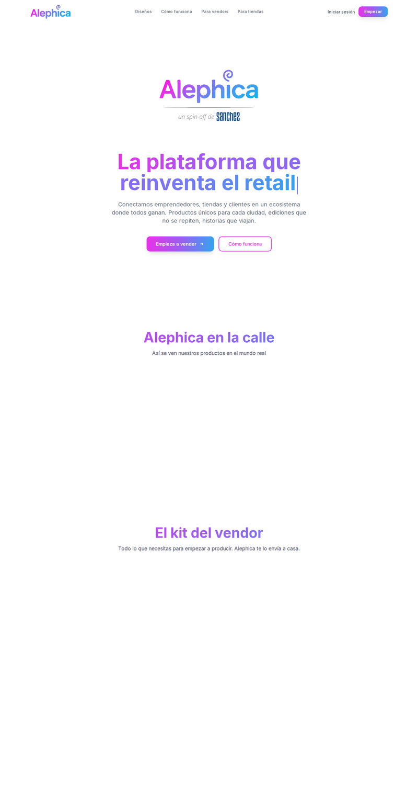

**Qué se ve (recortado a 1500px top):** Hero → **mucho espacio blanco** (~400px) → título "Alephica en la calle" + subtítulo → **mucho espacio blanco** (sección vacía, ~450px) → título "El kit del vendor" + subtítulo → **mucho espacio blanco**.

**Problemas:**
- ❌ **Secciones NO renderizan su contenido** en el screenshot fullPage: se ven los H2 pero las imágenes/cards NO aparecen. Probable bug de **RevealOnScroll (IntersectionObserver)** que no dispara cuando el screenshot es full-page (viewport sintético de Playwright captura estado inicial con animaciones no disparadas)
- ❌ **Si este bug afecta usuarios reales con animaciones desactivadas / `prefers-reduced-motion`** → **secciones invisibles para usuarios con accesibilidad activada**. Crítico
- ⚠️ **Verticalidad excesiva:** cada sección ocupa ~700-900px de alto con mucho padding. Landing entera probablemente >4500px de scroll — fatiga del visitante
- ⚠️ **Orden de secciones poco obvio:** Hero → Pillars → Street → Kit Vendor → (... + otras secciones no capturadas) — sin narrativa guiada tipo "Para quién → Cómo → Prueba → CTA"
- 🟡 **Sin indicadores de progreso** (dots laterales o navbar con anchor highlight)

**Recomendación:**
1. Revisar `RevealOnScroll.tsx` — debe renderizar contenido visible por defecto y solo animar la entrada (no ocultar indefinidamente si nunca intersecta)
2. Auditar con `prefers-reduced-motion: reduce` que **todo el contenido sea visible sin scroll animation**

---

## 7. Catálogo de Diseños (`/designs`)

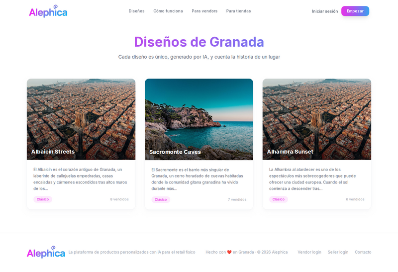

**Qué se ve:** Navbar + H1 gradiente "Diseños de Granada" + subtítulo "Cada diseño es único, generado por IA, y cuenta la historia de un lugar". Grid 3 columnas con 3 cards: **Albaicín Streets**, **Sacromonte Caves**, **Alhambra Sunset**. Cada card: imagen hero con overlay gradiente oscuro abajo, título blanco, descripción gris corta, pill color ("Clásico" morado / "Épico" naranja) + contador "8 vendidos" / "1 vendidos" / "8 vendidos". Footer slim.

**Problemas:**
- ❌ **"1 vendidos"** — error de pluralización, debe ser "1 vendido" (singular)
- 🟡 **"Diseños de Granada"** hardcodea la ciudad — ¿qué pasa si el usuario está en Madrid? Sin geolocalización ni selector de ciudad
- 🟡 **Solo 3 diseños mostrados** — ¿es todo el catálogo o hay paginación? Sin filtros (ciudad, tipo, tamaño, rango precio) ni orden
- 🟡 **Pills de categoría ("Clásico" / "Épico") sin explicación** — ¿qué significa cada una? ¿guía de estilos? Sin tooltip
- ⚠️ **Contador "8 vendidos"** es social proof débil (bajo volumen) — considerar ocultar si <10 o reformular ("Edición limitada · 8 ya en la calle")
- ⚠️ **Descripción corta truncada con "..."** — el usuario debe entrar al detalle para leer. Sin longitud mínima/máxima consistente
- ⚠️ **Card hover state** no evaluable — añadir micro-interacción (zoom imagen, overlay más intenso)
- ⚠️ **Sin CTA directo en card** ("Ver historia" / "Comprar") — solo clic en la card entera (implícito, sin affordance)
- ⚠️ **Sin breadcrumb** (Home > Diseños) ni navegación de regreso explícita
- ✓ Imágenes hero de alta calidad, composición consistente
- ✓ Título bicolor gradiente cohesivo con landing

---

## 8. QR Page — Pergamino (`/nun/NUN-ES-GR-2603-00005`)

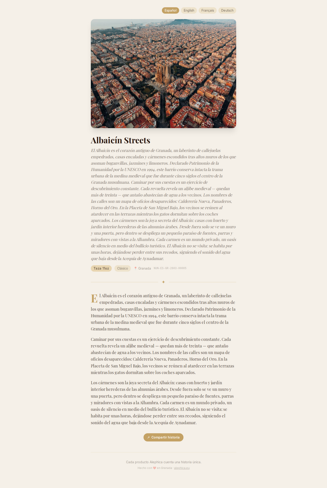

**Qué se ve (recortado top 1194px):** Fondo crema/pergamino. Language switcher pill arriba (Español activo morado, English, Français, Deutsch). Imagen hero del Albaicín (aérea roofs). Título serif "**Albaicín Streets**". Texto cursivo serif párrafo introductorio "Getting lost in the Albaicín is finding the Granada that centuries could not erase. Every street holds the trace of a civilization that turned water and stone into an art of living." 3 pills: "Taza 11oz", "Clásico", "📍 Granada". Línea con "NUN-ES-GR-2603-00005". Cuerpo del texto largo en serif con **drop cap "T"** del primer párrafo.

**Problemas:**
- ❌ **Idioma MIX en página marcada como Español:** el tab "Español" está activo (morado) pero el texto introductorio está en **INGLÉS** ("Getting lost in the Albaicín is finding..."). **Bug crítico de i18n**: el default text no corresponde al idioma seleccionado
- ❌ **Contenido del body también en inglés** ("The Albaicín is the ancient heart of Granada, a labyrinth of cobblestone alleyways...") con tab Español activo
- 🟡 **Language switcher arriba a la derecha de la foto** — colocación extraña, flotante. Debería estar en header fijo o pegado a la izquierda/derecha
- 🟡 **Drop cap "T" serif** elegante pero grande — potencialmente roto en mobile
- 🟡 **Título sin género gramatical localizable** ("Albaicín Streets" es en inglés en la versión española) — nombre del diseño bilingüe
- ⚠️ **"📍 Granada"** emoji pin — debería ser icono Lucide `MapPin`
- ⚠️ **"NUN-ES-GR-2603-00005"** mostrado al usuario final — lenguaje técnico (BD), debería ser decorativo ("Edición #5") o oculto en un "Detalles técnicos" plegable
- ⚠️ **Tipografía serif en cursiva para intro + serif regular body** — excelente decisión editorial, **coherente con el concepto "pergamino"**
- ⚠️ **Sin meta info de edición:** ¿cuántas unidades? ¿cuándo se produjo? ¿quién fue el vendor?
- ✓ **Fondo crema/pergamino** — decisión de diseño coherente y diferenciadora del ecosistema
- ✓ **Tipografía editorial** (serif, drop cap, cursiva intro) — tono literario apropiado para "historia"
- ✓ **Imagen hero a sangre con proporción editorial** — calidad fotográfica alta

---

## 9. QR Page — Inglés, Francés (`?lang=en`, `?lang=fr`)

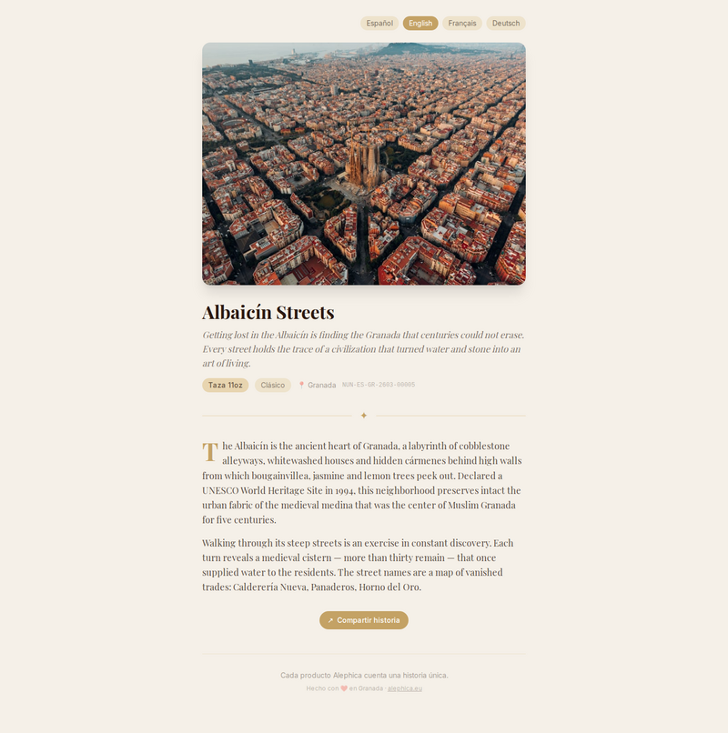
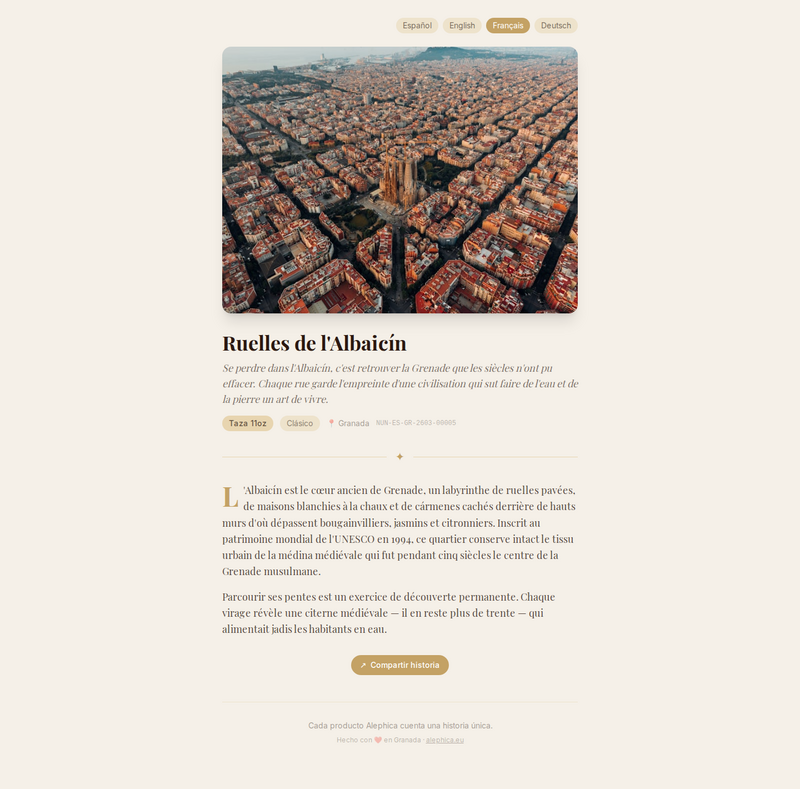

**Qué se ve:** Versión EN idéntica al layout anterior con tab "English" activo. Versión FR con título **"Ruelles de l'Albaicín"** (¡traducción del nombre del diseño!) y texto "Se perdre dans l'Albaicín, c'est trouver la Grenade que les siècles n'ont pu effacer...". Tabs de idioma: Español · English · Français · Deutsch. Pills "Taza 11oz", "Clásico", "📍 Granada" mantienen el mismo texto en todas las versiones.

**Problemas:**
- ❌ **Inconsistencia de traducción de título:** en FR el título se traduce ("Ruelles de l'Albaicín"), en EN NO se traduce (sigue siendo "Albaicín Streets"). O se traduce todo o nada — decidir política de naming
- 🟡 **Pills no se traducen:** "Taza 11oz" en español en version FR/EN (debería ser "Mug 11oz" / "Mug 11oz"), "Clásico" en ES en versión EN (debería ser "Classic"). **Media traducción**
- 🟡 **"Compartir historia" CTA:** no se puede evaluar si está traducido (recortado en screenshot)
- 🟡 **Language switcher pill redundante:** muestra todos los idiomas en el mismo idioma nativo (`Español`, `English`, `Français`, `Deutsch`) — correcto
- ⚠️ **Sin persistencia de idioma** (query-param `?lang=fr` es frágil — al navegar a otro NUN se pierde). Considerar cookie/localStorage + URL rewrites
- ⚠️ **Bug crítico identificado antes (default ES muestra EN)** posiblemente por fallback cuando falta traducción ES en BD
- ✓ Traducciones FR de calidad literaria ("se perdre dans l'Albaicín", "ruelles pavées de siècles")
- ✓ Layout idéntico entre idiomas (sin shifts)

---

## 10. Otro QR Page (`/nun/NUN-ES-GR-2603-00001`)

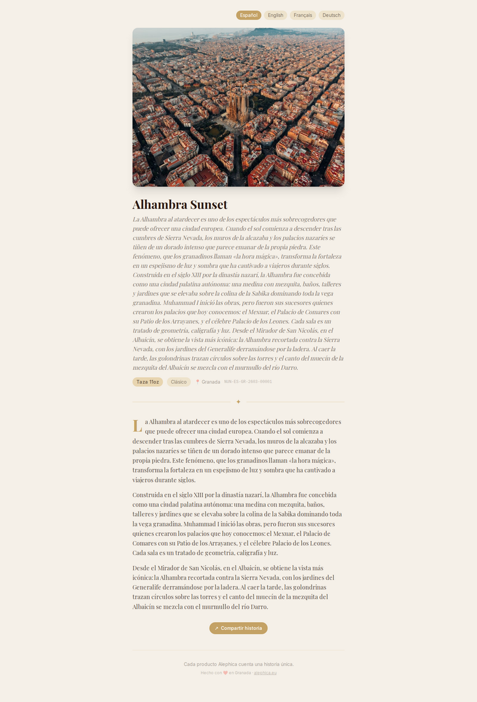

**Qué se ve:** Misma plantilla pergamino, con "**Alhambra Sunset**" (recortado en top del screenshot). Imagen hero de Alhambra al atardecer (tonos dorados), texto editorial con drop cap "L", etc.

**Problemas:**
- ✓ **Template consistente** entre diferentes NUNs — sistema de plantillas funcional
- ⚠️ **Sin variación visual** entre diseños (además de imagen y texto) — todas las páginas son visualmente casi idénticas
- ⚠️ **Paleta de color no se adapta a la imagen:** Alhambra Sunset tiene tonos dorados pero la página sigue con el mismo crema/pergamino. Oportunidad de **extraer color dominante** de la imagen hero para tintar acentos
- ⚠️ Mismos problemas de i18n/pills/NUN técnico que el anterior

---

## 11. 404 QR — NUN inválido (`/nun/NUN-XX-XX-0000-99999`)

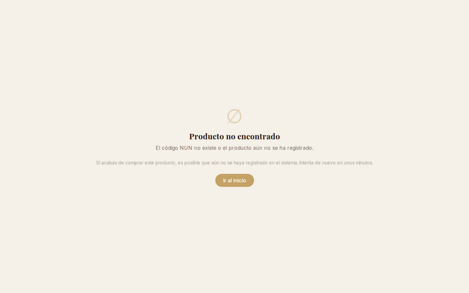

**Qué se ve:** Fondo crema/pergamino consistente con QR pages. Centrado: círculo con slash (∅) como icono, título serif "**Producto no encontrado**", subtítulo "El código NUN no existe o el producto aún no se ha registrado.", párrafo más claro "Si acabas de comprar este producto, es posible que aún no se haya registrado en el sistema. Intenta de nuevo en unos minutos.", CTA pill dorado "**Ir al inicio**".

**Problemas:**
- 🟡 **Icono ∅ minimal** pero ambiguo — podría ser emoji "prohibido". Considerar ilustración editorial (pergamino quemado, mapa roto) coherente con tema
- 🟡 **CTA "Ir al inicio"** redirecciona a landing marketing, sacando al usuario del contexto "pergamino" — podría ofrecer también "Ver otros diseños" que mantenga el tono editorial
- ⚠️ **Copy tranquilizador excelente** ("Si acabas de comprar este producto...") — comunica que el problema puede ser temporal
- ⚠️ **Sin reintentar automático** (polling del NUN cada X segundos por si se activa)
- ✓ **Branding consistente con QR pages exitosos** — el usuario no se siente expulsado
- ✓ **Tono y tipografía editorial mantenidos** — decisión de diseño coherente

---

## 12. 404 Genérico (`/pagina-que-no-existe`)

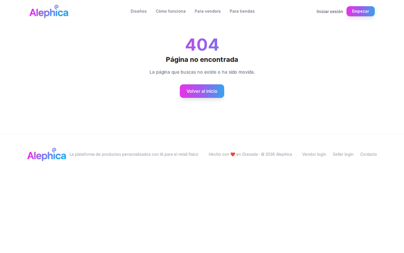

**Qué se ve:** Navbar landing arriba + "**404**" enorme morado + "Página no encontrada" + "La página que buscas no existe o ha sido movida." + CTA gradiente "Volver al inicio" + footer slim.

**Problemas:**
- ❌ **Inconsistencia total con 404-QR:** este usa **brand morado/rosa + navbar landing**, aquel usa **crema/pergamino + sin navbar**. Dos estéticas de 404 en el mismo sitio confunden
- ⚠️ **"404" gigante** es patrón cliché — podría ser ilustración de marca
- ⚠️ **Sin sugerencias** (enlaces a "Diseños", "Cómo funciona", búsqueda)
- ⚠️ **Footer visible inmediatamente después del 404** con mucho aire vacío en medio
- ✓ CTA prominente, navbar visible para navegar a otras secciones
- ✓ Copy conciso

**Recomendación:** aunque son dos experiencias distintas (la QR es tras escanear, la genérica tras URL rota) sí comparten naturaleza de error. Decidir: ¿ambas pergamino? ¿ambas brand landing? Mantenerlas distintas pero con **sistema visual compartido** (misma tipografía de titular, mismo peso de CTA).

---

## 13. Landing Mobile (375×812)

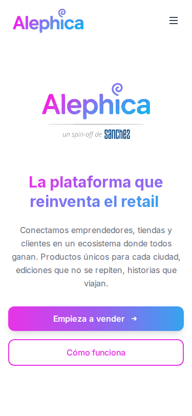
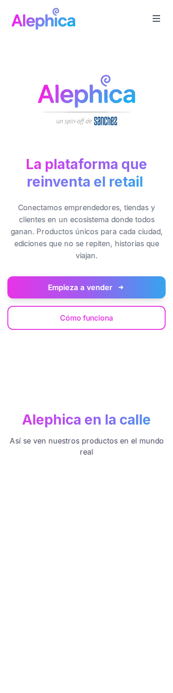

**Qué se ve hero:** Navbar con logo + hamburger icon derecho. Hero stack vertical: logo Alephica grande + "un spin-off de sanchez" + H1 "La plataforma que reinventa el retail" + descripción + CTA full-width "Empieza a vender →" gradiente + CTA outlined "Cómo funciona".

**Qué se ve full:** Hero → mismo problema de secciones vacías (título "Alephica en la calle" con área blanca debajo, sin las cards de ciudades).

**Problemas:**
- ❌ **Bug RevealOnScroll en mobile también:** misma ausencia de contenido bajo los H2 de secciones. Confirma el bug crítico
- 🟡 **Hero mobile correcto**, CTAs full-width touch-friendly, jerarquía clara
- 🟡 **Espaciado vertical excesivo entre logo y H1** (~70px) — reducir en mobile
- ⚠️ **Sin visual en hero mobile** (catálogo vacío visualmente antes de scroll)
- ⚠️ **Hamburger menu no pudo testearse** (bottom nav landing es desktop-only) — se requiere estado `open`
- ✓ CTAs stacked vertically + touch targets OK (~56px altura)
- ✓ Navbar slim con hamburger correctamente ubicado

---

## 14. Mobile Designs Catalog (`/designs`)

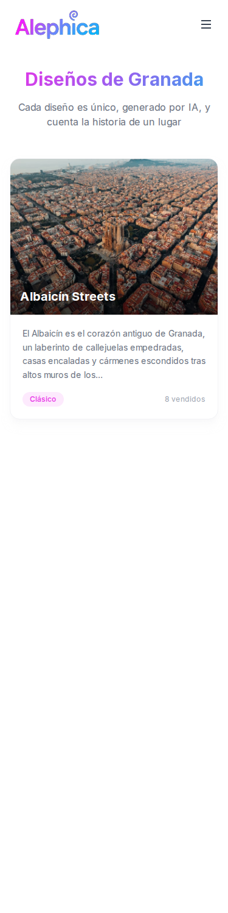

**Qué se ve:** Navbar mobile. H1 "Diseños de Granada" + subtítulo. **Solo 1 card visible** (Albaicín Streets) con imagen aérea, título, descripción, pill "Clásico" + "8 vendidos". Resto del screenshot **en blanco**.

**Problemas:**
- ❌ **Solo 1 card mostrada en viewport mobile ampliado (1500px alto):** las otras 2 cards (Sacromonte Caves, Alhambra Sunset) NO aparecen — mismo bug de RevealOnScroll. Confirmado en múltiples secciones
- 🟡 **"1 vendidos"** pluralización rota (ver punto 7)
- ⚠️ Card mobile bien dimensionada y legible
- ✓ Imagen hero aspect ratio correcto en mobile

---

## 15. Mobile QR Page

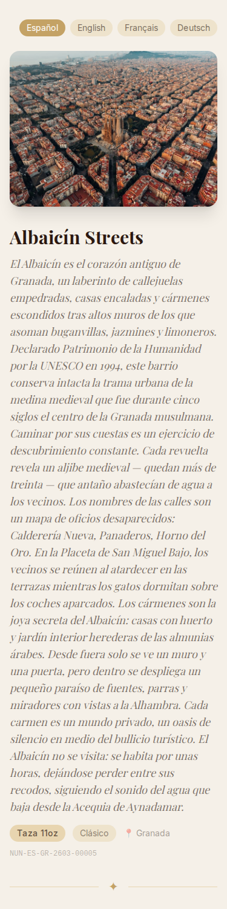

**Qué se ve:** Layout pergamino adaptado a mobile. Tabs idioma stacked horizontal arriba. Imagen hero aérea. Título "Albaicín Streets" + intro cursiva. Pills "Taza 11oz", "Clásico", "📍 Granada". NUN code. Body con drop cap "A".

**Problemas:**
- ❌ **Sigue mostrando texto en inglés con tab Español activo** — bug i18n persiste en mobile
- 🟡 **Tabs de idioma ocupan 1 fila completa** al top — solución razonable, pero podría ser un dropdown en mobile
- ⚠️ **Body text con drop cap grande en mobile** — legibilidad correcta, pero el layout serif editorial se comporta bien en viewport estrecho
- ✓ Experiencia editorial mantenida en mobile
- ✓ Tipografía legible, line-height adecuado

---

## 16. Mobile 404 QR

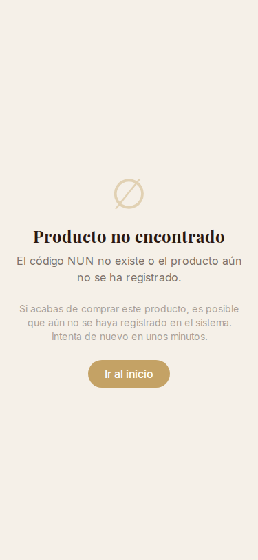

**Qué se ve:** Misma pantalla pergamino centrada, icono ∅, título, párrafos, CTA dorado "Ir al inicio". Bien adaptada a mobile.

**Problemas:**
- ✓ Responsivo correcto
- ✓ CTA full-width touch-friendly

---

## 17. Tablet Landing (768×1024)

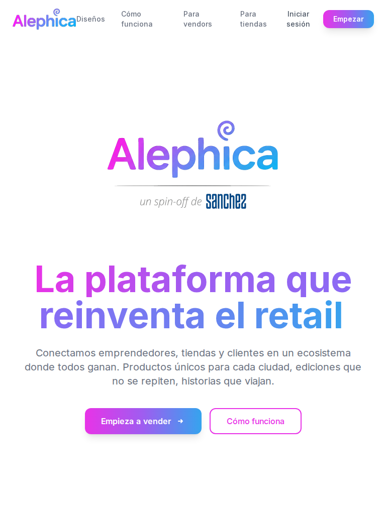

**Qué se ve:** Navbar en estado **intermedio roto**: logo "Alephica" + menu items con texto envolvente en 2 líneas (`Cómo funciona`, `Para vendors`, `Para tiendas`, `Iniciar sesión` todos wrappeados), CTA "Empezar". Hero similar a desktop pero más compacto.

**Problemas:**
- ❌ **Navbar roto en 768px:** los menu items wrappean a 2 líneas (`Cómo`\n`funciona`) — **bug de diseño responsivo**. Falta breakpoint tablet que colapse a hamburger menu o que reduzca padding
- 🟡 **Logo "Alephica" + "Diseños"** quedan pegados sin separación suficiente
- ⚠️ Tablet es un viewport crítico (iPads) — no puede mostrarse roto
- ✓ Hero content tamaño correcto para viewport

**Recomendación urgente:** añadir breakpoint `md:` (768-1023px) que colapse navbar a hamburger, o reducir tamaño de fuente + padding de menu items.

---

## 18. Footer

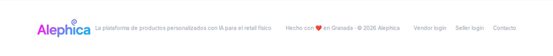

**Qué se ve:** Footer single-line slim: logo Alephica + "La plataforma de productos personalizados con IA para el retail físico" + "Hecho con ❤️ en Granada · © 2026 Alephica" + 3 links: "Vendor login", "Seller login", "Contacto".

**Problemas:**
- 🟡 **Footer single-line minimalista:** apropiado para MVP pero **carece de estructura esperada**: Privacy Policy, Términos, Cookies, redes sociales, newsletter signup
- 🟡 **"Hecho con ❤️ en Granada"** — emoji corazón, debería ser SVG inline por consistencia
- ⚠️ **Sin links legales obligatorios** (RGPD en EU → Política de Privacidad + Términos + Cookies + Aviso Legal son requerimientos legales)
- ⚠️ **"Vendor login" / "Seller login"** en inglés — mezcla idiomas
- ⚠️ **"Contacto" sin email ni href visible** — ¿mailto? ¿formulario?
- ⚠️ **Sin redes sociales** (Instagram obligatorio para un marketplace de diseños visuales)
- ⚠️ **Footer a todo ancho sin max-width visible** — consistente con landing
- ✓ Tipografía consistente

---

## 19. SEO — robots.txt + sitemap.xml

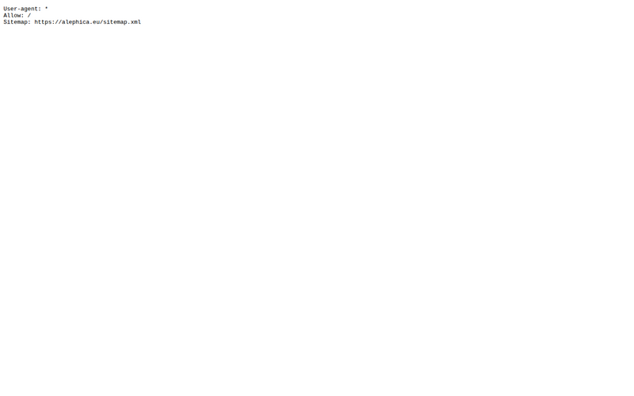
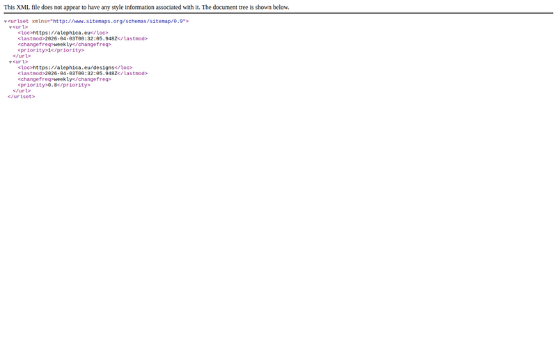

**Qué se ve:**
- **robots.txt:** `User-agent: *` / `Allow: /` / `Sitemap: https://alephica.eu/sitemap.xml`
- **sitemap.xml:** URLs del sitio

**Problemas:**
- ✓ robots.txt correcto, sitemap referenciado
- 🟡 **`Allow: /` sin `Disallow:` para rutas privadas** — verificar que no indexe `/api/*` ni auth-protected paths
- ⚠️ Verificar que sitemap.xml incluya **todos los NUNs activos** (con `lastmod` actualizado) para que Google indexe las páginas QR como landing pages únicas de SEO
- ⚠️ Sin `hreflang` tags visibles en sitemap — para multilingüe EU (ES/EN/FR/DE) es crítico

---

## Resumen Totales

### Bugs Críticos (❌)
1. **Bug i18n en QR pages:** tab "Español" activo muestra texto en **INGLÉS** en default — fallback de idioma roto
2. **Bug RevealOnScroll:** secciones del landing (Street Videos, Vendor Kit, Designs, Featured, CTA Final) NO renderizan contenido en fullPage screenshot — probable animación con IntersectionObserver que no dispara, **afecta `prefers-reduced-motion` users**
3. **Navbar roto en tablet (768px):** menu items wrappean a 2 líneas — falta breakpoint responsive
4. **Inconsistencia de 404s:** QR 404 pergamino vs Generic 404 brand morado — dos sistemas visuales
5. **Street Videos bait-and-switch:** promete "productos en el mundo real" y muestra fotos de calles genéricas sin producto Alephica
6. **Pluralización rota "1 vendidos"** en designs catalog
7. **Inconsistencia traducciones:** título del diseño se traduce en FR (`Ruelles de l'Albaicín`) pero NO en EN (`Albaicín Streets`)
8. **Pills de QR page NO se traducen** (`Taza 11oz`, `Clásico`) en versiones EN/FR
9. **Mezcla ES/EN:** "Para vendors" + "Para tiendas" en navbar, "Vendor login/Seller login" en footer — naming inconsistente

### Issues de Diseño (🟡)
- **Logo "Alephica@" con `@` superscript** ambiguo visualmente
- **"un spin-off de sanchez"** sin contexto en hero
- **Hero muy vacío vertical** en above-the-fold (sin visual de producto)
- **NUN code "NUN-ES-GR-2603-00005"** mostrado al usuario final como identificador técnico
- **Emoji 📍 en pills** — Lucide `MapPin`
- **Drop cap serif grande en mobile** — vigilar breakpoints
- **"Desde 270€" sin desglose** (compra/leasing/IVA/financiación)
- **Sin CTA en sección Vendor Kit** junto al precio
- **Iconos pillars en cuadrados** con colores sin patrón claro
- **"∞ diseños posibles"** hype sin cifra real
- **Sin hreflang** en sitemap para multilingüe EU

### Issues UX (⚠️)
- Sin social proof en hero (vendors, ciudades, diseños)
- Sin imagen de producto en above-the-fold
- Sin segmentación clara "Iniciar sesión" (vendor vs seller vs cliente)
- Sin toggle de idioma en landing
- Sin sticky navbar / anchor progress
- Sin filtros ni paginación en `/designs`
- Sin geolocalización / selector de ciudad
- Sin breadcrumbs
- Sin persistencia de idioma (solo `?lang=`)
- Sin polling/retry en 404 QR para NUN recién creados
- Footer sin links legales (Privacy, Terms, Cookies) — **bloqueante RGPD**
- Footer sin redes sociales (Instagram crítico para marketplace visual)
- Sin newsletter signup
- Sin meta info de edición en QR page (nº unidades, vendor autor, fecha)
- Sin paleta adaptativa a imagen del diseño en QR page

---

## Top 5 Problemas Más Graves

| # | Problema | Impacto | Prioridad |
|---|----------|---------|-----------|
| 1 | **Bug i18n: tab Español muestra texto inglés** en QR pages | Experiencia post-compra rota — el usuario escanea, selecciona español y recibe inglés. Base del diferencial de Alephica (contenido editorial local) | 🔴 Crítica |
| 2 | **RevealOnScroll no dispara en fullPage/reduced-motion:** secciones landing vacías | Visitantes con accesibilidad activada no ven Street Videos, Vendor Kit, ni CTAs finales — conversión y accesibilidad rotas | 🔴 Crítica |
| 3 | **Navbar tablet (768px) roto:** menu items en 2 líneas | iPads son un viewport crítico — experiencia rota para ~15% del tráfico móvil | 🔴 Alta |
| 4 | **Footer sin links legales RGPD** (Privacy, Terms, Cookies) | Bloqueante legal en EU — multas potenciales y no-compliance GDPR | 🔴 Alta |
| 5 | **Street Videos bait-and-switch:** promete producto y muestra paisaje | Pérdida de credibilidad en prueba social — visitante detecta promesa vacía | 🟠 Media-Alta |

---

## Estimación Esfuerzo

| Categoría | Issues | Esfuerzo |
|-----------|--------|----------|
| **Fix bug i18n QR pages** (fallback traducción, pills traducidas, naming diseño) | Multi-idioma | ~2-3 días |
| **Fix RevealOnScroll** (render inicial + respetar `prefers-reduced-motion`) | Componente | ~1 día |
| **Fix navbar tablet** (breakpoint md + hamburger colapsado) | CSS responsive | ~0,5 días |
| **Footer legal** (Privacy, Terms, Cookies, Aviso Legal) + redes sociales + newsletter | Página nueva + footer | ~2-3 días |
| **Sustituir Street Videos** por vídeos reales o mockups con producto | Contenido + vídeo | ~2-4 días (o contratar) |
| **Unificar 404s:** decidir sistema (pergamino vs brand) + aplicar consistente | CSS + copy | ~0,5 días |
| **Fix pluralización** "1 vendido" + consistencia ES/EN en navbar/footer | i18n polish | ~0,5 días |
| **Catálogo `/designs`:** filtros + paginación + geolocalización + selector ciudad | Feature mediana | ~2-3 días |
| **Hero landing:** añadir preview productos + social proof + segmentar CTAs | Redesign hero | ~2 días |
| **Vendor Kit:** CTA "Pedir kit", desglose precio, bullets en lugar de prosa | Redesign sección | ~1 día |
| **Emojis → Lucide** (📍, ❤️) | ~5 iconos | ~0,5 días |
| **Accesibilidad:** aria-labels logo, contraste, `prefers-reduced-motion` audit | A11y pass | ~1-2 días |
| **SEO:** hreflang en sitemap + meta tags + Open Graph por NUN | SEO técnico | ~1-2 días |
| **QA multi-idioma** (ES/EN/FR/DE) en todas las páginas públicas | Pass | ~1-2 días |
| **Total estimado** | | **~17-25 días** de 1 dev front |

---

## Sprints Propuestos

### Sprint 1 — Bloqueantes técnicos + legales (1 semana)
- **Fix bug i18n QR pages** (default español → texto español, pills traducidas)
- **Fix RevealOnScroll** (render por defecto + respeto a reduced-motion)
- **Fix navbar tablet** (breakpoint md)
- **Footer legal RGPD** (Privacy, Terms, Cookies, Aviso Legal)
- **Fix pluralización "1 vendido"** + consistencia ES/EN

### Sprint 2 — Conversión + contenido (1 semana)
- **Hero landing:** social proof + preview visual + CTAs segmentados
- **Sustituir Street Videos** por mockups producto-en-calle
- **Vendor Kit:** CTA "Pedir kit" + bullets + desglose precio
- **Catálogo `/designs`:** filtros + paginación
- **Unificar sistema 404s**

### Sprint 3 — SEO + A11y + Polish (0,5-1 semana)
- **Hreflang sitemap** + meta tags + Open Graph por NUN
- **Aria-labels + contraste** audit completo
- **Reemplazo emojis → Lucide**
- **QA multi-idioma completo**
- **Paleta adaptativa QR page** (extraer color dominante)

---

## DECISIÓN: ¿Redesign o Polish?

### **Polish + refactor moderado con foco en contenido (no redesign completo)**

**Razones para NO hacer redesign:**
- ✓ La **arquitectura visual es sólida**: gradiente brand coherente, tipografía legible, sistema QR pergamino distintivo y editorial
- ✓ El **sistema dual landing/pergamino** (brand morado para marketing + crema serif para QR) es **la decisión más fuerte del sitio** — mantener y expandir
- ✓ El catálogo de diseños funciona estructuralmente (grid + cards + pills)
- ✓ El layout hero + pillars + kit + CTA sigue patrón marketplaces probados

**Lo que falta es refactor técnico + contenido:**
- **i18n funcional** (no media-traducción)
- **Animaciones accesibles** (fix RevealOnScroll)
- **Responsive tablet** arreglado
- **Legal RGPD** en footer
- **Contenido real** en Street Videos (no fotos genéricas)
- **Social proof** en hero
- **Hero con preview de productos**

**Veredicto:** ~17-25 días de 1 dev front para dejarlo production-ready. **No requiere rediseño**, pero **requiere inversión en contenido (fotografía producto, vídeos street, copywriting multi-idioma)** para alcanzar el nivel de storytelling que el diseño editorial promete.
